# AMANA Planning — Documentation complète

## Table des matières

1. [Présentation du projet](#présentation-du-projet)
2. [Architecture technique](#architecture-technique)
3. [Rôles et permissions](#rôles-et-permissions)
4. [Vues et fonctionnalités](#vues-et-fonctionnalités)
5. [Gestion des utilisateurs](#gestion-des-utilisateurs)
6. [Algorithme de génération du planning](#algorithme-de-génération-du-planning)
7. [Export PDF](#export-pdf)
8. [Système de notifications](#système-de-notifications)
9. [Échanges de créneaux](#échanges-de-créneaux)
10. [Bilan quotidien](#bilan-quotidien)
11. [Intégration Make.com (Webhook)](#intégration-makecom-webhook)
12. [Déploiement — pipeline GitHub Actions → IONOS](#déploiement--pipeline-github-actions--ionos)

## Documentation complémentaire

| Document                                     | Description                                                                                       |
| -------------------------------------------- | ------------------------------------------------------------------------------------------------- |
| [docs/installation.md](docs/installation.md) | Prérequis, installation locale, déploiement IONOS, référence des routes, résolution des problèmes |
| [docs/Schema_bdd.md](docs/Schema_bdd.md)     | Schéma complet de la base de données, diagramme des relations, description de chaque table        |

---

> 📖 **Guides détaillés**
>
> - [**Guide d'installation**](docs/installation.md) — mise en place locale et production, référence complète des routes, résolution des problèmes courants
> - [**Schéma de la base de données**](docs/Schema_bdd.md) — description de chaque table, diagramme ERD, notes sur les fonctionnalités applicatives

---

## Présentation du projet

AMANA Planning est une application web de gestion des permanences hebdomadaires de l'association AMANA. Elle automatise la répartition équitable des tâches entre les membres bénévoles, chaque vendredi et samedi soir.

**Tâches planifiées :**

| Code         | Libellé    | Actif dans le scheduler | Description                                      |
| ------------ | ---------- | :---------------------: | ------------------------------------------------ |
| `entree`     | Entrée     |           ✅            | Accueil des bénéficiaires à l'entrée             |
| `mektaba`    | Mektaba    |           ✅            | Gestion de la bibliothèque / espace documentaire |
| `salle`      | Salle      |           ✅            | Préparation et rangement de la salle             |
| `amana_food` | Amana Food |           ✅            | Distribution alimentaire                         |
| `cours`      | Cours      |           ✅            | Animation du cours du soir                       |

Les tâches suivantes existent dans `ref_taches` mais ne sont **pas incluses dans la rotation du scheduler** (`actif = false`). Elles ne servent qu'à calculer les horaires du payload webhook :

| Code                    | Libellé               |
| ----------------------- | --------------------- |
| `rappel_sandwich`       | Rappel Sandwich       |
| `assistance_amana_food` | Assistance Amana Food |
| `annonce_cours`         | Annonce Cours         |
| `message_bot`           | Message Général       |
| `annulation_cours`      | Annulation Cours      |

---

## Architecture technique

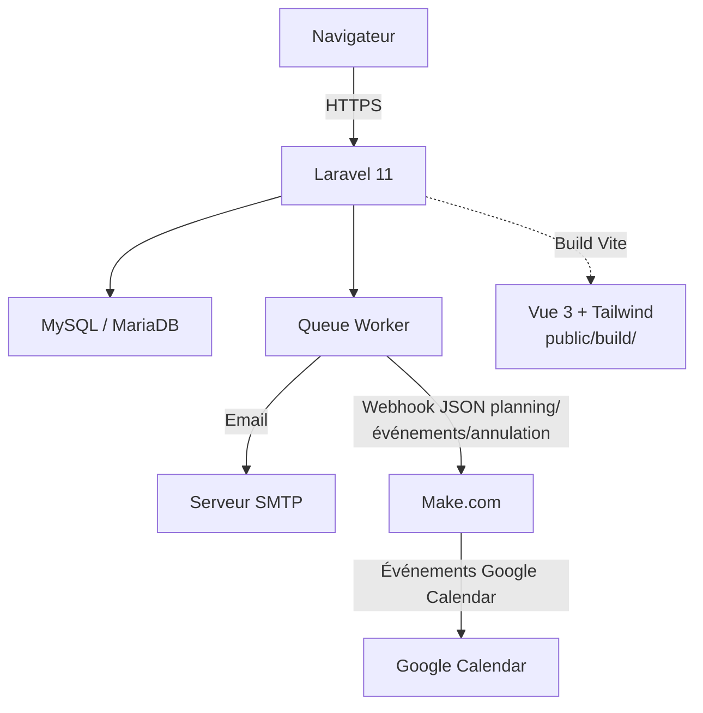

**Stack :**

- **Backend :** Laravel 11 (PHP 8.2+)
- **Base de données :** MySQL 8 / MariaDB 10.4+
- **Frontend :** Blade pour le rendu serveur (layout, formulaires simples) + **Vue 3** pour les vues interactives (planning, événements, bilan quotidien, formulaires avec sélection multiple…), compilé par **Vite** avec **Tailwind CSS**. Le build produit `public/build/` (non committé dans git — voir [docs/installation.md](docs/installation.md)), chargé côté Blade via la directive `@vite(...)`.
- **PDF :** barryvdh/laravel-dompdf
- **Queue :** Laravel Queue (driver `database` en prod, `sync` supporté en dev)
- **Automatisation externe :** Make.com via webhook (planning, événements organisationnels **et** annulations de cours)
- **CI/CD :** GitHub Actions (`.github/workflows/deploy.yaml`) — build (`composer install` + `npm run build`) et déploiement automatique sur IONOS par SSH/rsync à chaque push sur `tailwind`. Voir [docs/installation.md](docs/installation.md#déploiement-en-production--pipeline-github-actions--ionos).

**Configuration dynamique :**

Tous les paramètres applicatifs (heure du cours, lieu, offsets horaires, noms de calendriers, ouverture des inscriptions) sont stockés dans la table `ref_settings` et gérés via la page **Paramètres** (`/parametres`). Il n'y a **pas** de variable d'environnement pour l'heure du cours — la clé `.env` `HEURE_COURS` présente dans les anciennes versions du projet est obsolète et ignorée.

---

## Rôles et permissions

L'application définit quatre rôles dans l'application `planning`. Chaque personne ne peut avoir qu'un seul rôle à la fois.

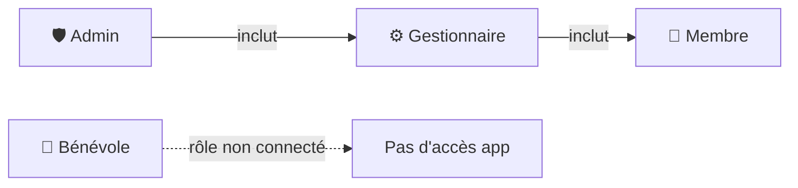

### Tableau des accès

| Fonctionnalité                                                                         | Admin | Gestionnaire |    Membre    |
| -------------------------------------------------------------------------------------- | :---: | :----------: | :----------: |
| Voir le planning                                                                       |  ✅   |      ✅      |      ✅      |
| Voir mon planning personnel                                                            |  ✅   |      ✅      |      ✅      |
| Voir les statistiques                                                                  |  ✅   |      ✅      |      ✅      |
| Export PDF                                                                             |  ✅   |      ✅      |      ✅      |
| Voir les absences                                                                      |  ✅   |      ✅      |      ✅      |
| Ajouter/supprimer ses absences                                                         |  ✅   |      ✅      |      ✅      |
| Ajouter/supprimer toutes les absences                                                  |  ✅   |      ✅      |      ❌      |
| Voir les disponibilités (grille complète)                                              |  ✅   |      ✅      | ✅ (lecture) |
| Modifier ses disponibilités                                                            |  ✅   |      ✅      |      ✅      |
| Modifier toutes les disponibilités                                                     |  ✅   |      ✅      |      ❌      |
| Générer le planning                                                                    |  ✅   |      ✅      |      ❌      |
| Prévisualiser le planning (dry-run)                                                    |  ✅   |      ✅      |      ❌      |
| Modifier le planning manuellement                                                      |  ✅   |      ✅      |      ❌      |
| **Annuler un cours (bloquer une date, tout désassigner)**                              |  ✅   |      ✅      |      ❌      |
| Rollback (annuler une génération)                                                      |  ✅   |      ✅      |      ❌      |
| Créer / modifier les événements                                                        |  ✅   |      ✅      |      ❌      |
| Configurer la synchro Google Calendar d'un événement (plusieurs calendriers possibles) |  ✅   |      ✅      |      ❌      |
| Voir les événements                                                                    |  ✅   |      ✅      |      ✅      |
| Demander un échange de créneau                                                         |  ✅   |      ✅      |      ✅      |
| Accepter/refuser un échange reçu                                                       |  ✅   |      ✅      |      ✅      |
| Annuler sa propre demande d'échange                                                    |  ✅   |      ✅      |      ✅      |
| Approuver/refuser n'importe quel échange (override)                                    |  ✅   |      ✅      |      ❌      |
| Voir / saisir le bilan quotidien                                                       |  ✅   |      ✅      |      ✅      |
| Paramètres de l'application                                                            |  ✅   | ✅ (partiel) |      ❌      |
| Ouvrir / fermer les inscriptions                                                       |  ✅   |      ❌      |      ❌      |
| Gérer les personnes (CRUD)                                                             |  ✅   |      ❌      |      ❌      |
| Valider / refuser les candidatures                                                     |  ✅   |      ❌      |      ❌      |

> **Note :** Les gestionnaires peuvent accéder à la page Paramètres et modifier les horaires, le lieu, les offsets et les noms de calendriers. Le paramètre **Inscriptions ouvertes/fermées** est réservé aux administrateurs — les gestionnaires voient la section en lecture seule.

---

## Vues et fonctionnalités

### 🏠 Planning (`/planning`)

Vue principale de l'application. Affiche les créneaux regroupés par semaine ISO, du plus récent au plus ancien.

**Fonctionnalités :**

- Par défaut : affichage glissant sur 12 mois (aujourd'hui − 1 an → futur). Un lien « Historique complet » charge tout l'historique à la demande.
- Filtre par année et par mois (filtre par défaut : mois courant + mois précédent, activé automatiquement)
- Bannières informatives par semaine pour les événements (informatifs ou bloquants)
- Clic sur une cellule → modale de réassignation (admin/gestionnaire)
- Bouton « + Créneau » pour ajouter manuellement un jour dans une semaine existante (admin/gestionnaire)
- Suppression d'un créneau ou d'une semaine entière (admin/gestionnaire)
- **Bouton rouge « 🚫 Annulation cours »** (admin/gestionnaire) — voir détail ci-dessous
- Toasts de confirmation en temps réel (AJAX)
- Bouton **« Mon planning »** dans le header → accès rapide à la vue personnelle

#### 🚫 Annulation cours

Bouton rouge dans la barre de filtres, visible uniquement pour les admins/gestionnaires. Permet d'annuler le cours d'une date **déjà générée**, en une action :

1. **Choisir une date** (obligatoirement future) dans une modale.
2. **Écran de confirmation** en français rappelant les conséquences (date bloquée, toutes les tâches désassignées, événements calendrier supprimés — action irréversible), avec la date reformulée en toutes lettres.
3. Une fois confirmé :
    - Toutes les tâches déjà assignées sur ce créneau sont **désassignées** (`id_personne = NULL`).
    - Un événement organisationnel **« Cours annulé — {date} »** est créé, bloquant automatiquement **toutes les tâches actives** pour cette date — il apparaît dans la liste des [Événements](#-événements-evenements) comme n'importe quel autre événement, et la grille du planning affiche immédiatement la date comme bloquée.
    - Tous les événements calendrier existants pour cette date sont supprimés côté Make.com (webhook `DELETE`).
    - Une annonce d'annulation est envoyée à Make.com comme n'importe quel autre événement social du planning (webhook `POST`, code `annulation_cours` — voir [Intégration Make.com](#intégration-makecom-webhook)).

Si **aucun planning n'a encore été généré** pour la date choisie, rien n'est modifié : un simple avertissement s'affiche dans la modale (« Aucun planning n'a encore été généré pour le … »).

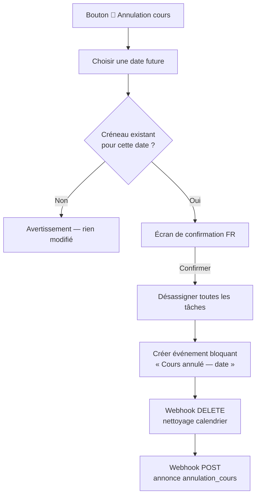

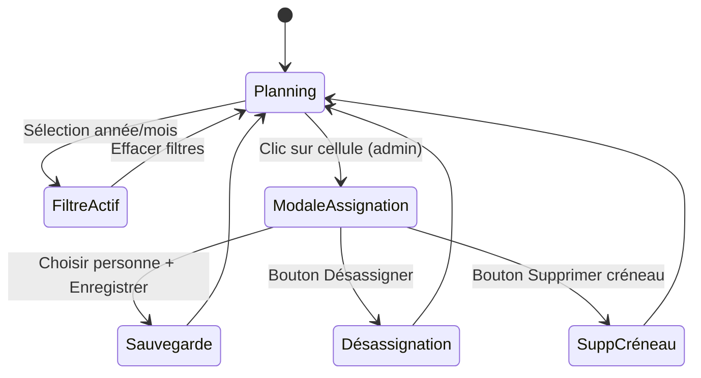

---

### 🙋 Mon planning (`/mon-planning`)

Vue personnelle filtrée pour le membre connecté. Accessible à tous les rôles depuis la barre latérale et depuis un bouton dans la vue Planning principale.

**Fonctionnalités :**

- Affiche uniquement les créneaux où **la personne connectée est assignée**
- Fenêtre temporelle identique à la vue Planning : un an glissant + futur
- Regroupement par **mois** avec compteur par section
- Chaque créneau est affiché en carte individuelle avec :
  - Bloc date (jour numérique, mois abrégé, nom du jour)
  - Chip de tâche colorée avec icône
  - Numéro de semaine ISO
  - Date complète et nom de l'événement éventuel
  - Badge de statut : **À venir** (futur), **Aujourd'hui**, **Effectué** (passé)
- Bandeau de statistiques rapides : total créneaux, nombre à venir, décompte par tâche
- **Bouton « 🔄 Échanger »** sur chaque créneau futur sans échange déjà en cours — ouvre une modale pour demander un échange avec un autre membre assigné à la même tâche (voir [Échanges de créneaux](#échanges-de-créneaux))
- **Badge « ⏳ Échange en attente »** affiché sur les créneaux déjà impliqués dans une demande non résolue
- Vue en **lecture seule** pour le reste — pas d'édition manuelle d'assignation (réservée à `/planning`)

---

### ✨ Générer le planning (`/planning/generer`)

Formulaire de génération automatique du planning.

**Paramètres :**

- Date de début (le premier vendredi suivant cette date sera utilisé)
- Nombre de semaines (1 à 52)

**Aperçu dynamique** : le formulaire calcule et affiche en temps réel les dates concernées avant soumission.

**Avertissement de chevauchement** : si des créneaux futurs existent déjà dans la période ciblée, la génération ne se déclenche **pas** immédiatement. À la place, un panneau d'avertissement s'affiche listant toutes les semaines qui seront écrasées, avec pour chacune le label, la plage de dates et le nombre de créneaux concernés. L'admin/gestionnaire doit choisir explicitement entre :

- **Confirmer et écraser** : relance la génération avec `confirmed=1`
- **Annuler** : efface la session et revient au formulaire vierge

**Prévisualisation (dry-run)** : le bouton **« 👁 Aperçu »** soumet les paramètres à une route dédiée (`/planning/generer/apercu`) qui exécute l'algorithme complet **sans rien persister** (transaction rollbackée). Le résultat s'affiche dans une vue preview marquée « Aperçu — non enregistré » avec un filigrane. Depuis cette vue, deux boutons « Confirmer et générer » (haut et bas) soumettent la génération réelle.

**Rollback** : après chaque génération, un panneau de rollback apparaît permettant d'annuler tout ou partie des créneaux générés (par semaine). La session de rollback est conservée jusqu'à fermeture explicite.

> ⚠️ Une génération qui supprime des créneaux existants supprime **en cascade** (`onDelete('cascade')`) tout échange de créneau en cours impliquant ces créneaux. Vérifiez les échanges en attente (`/admin/echanges`) avant de régénérer une période contenant des demandes non résolues.

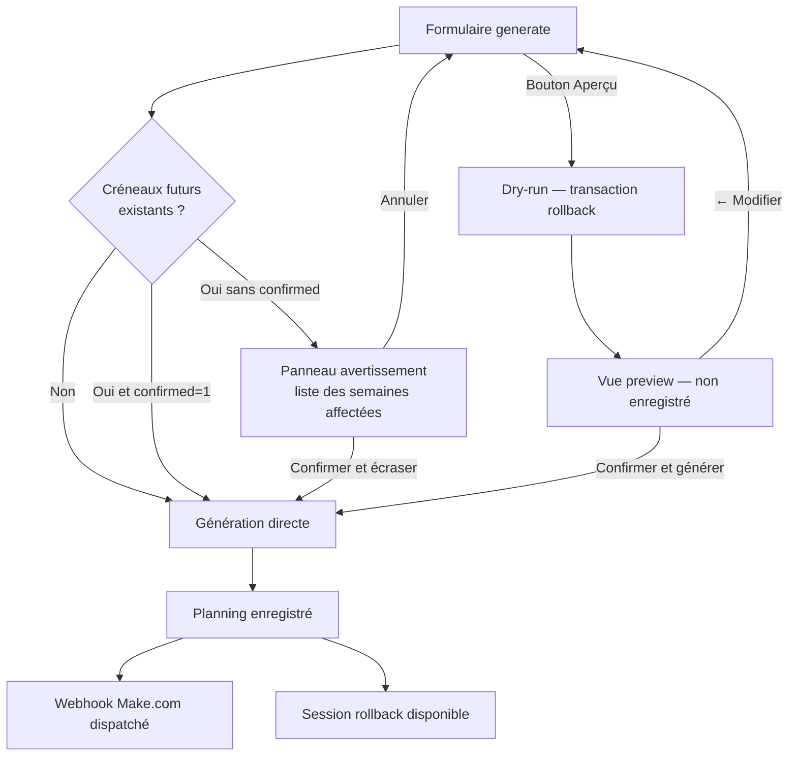

---

### 📊 Statistiques (`/planning/stats`)

Tableau de bord de l'équité de la répartition.

**Métriques affichées :**

- Score d'équité global (0–100)
- Écart-type et coefficient de variation
- Déséquilibre vendredi/samedi
- Distribution Amana Food (min/max/moy)
- Jours consécutifs maximum
- Détail par personne : total, vendredis, samedis, chaque tâche, absences

> Les statistiques sont calculées à partir de l'état **actuel** de `plan_creneaux_taches` — un échange de créneau accepté est donc immédiatement reflété dans les compteurs par personne, sans recalcul manuel.

> **Exception `cours` :** par convention une seule personne assure le cours chaque semaine (voir [Algorithme `cours`](#algorithme-cours-exception--assignation-directe-sans-score)). Ce créneau fixe et récurrent n'est **pas** un signal de déséquilibre de rotation ni de fatigue : il est donc exclu du score d'équité, du coefficient de variation, du déséquilibre vendredi/samedi et du calcul des jours consécutifs. Il reste en revanche visible dans la colonne **Cours** du détail par personne, pour garder une trace de combien de fois il a eu lieu.

---

### 📄 Export PDF (`/planning/export`)

Génère un fichier PDF du planning sur une plage de dates, au format A4 paysage.

---

### 🏖️ Absences (`/absences`)

Gestion des périodes d'absence. Une absence empêche l'assignation d'une personne pendant la période concernée lors de la génération du planning.

**Règles d'accès :**

- Tout le monde peut voir toutes les absences
- Un membre ne peut ajouter/supprimer que ses propres absences
- Admin/gestionnaire peut gérer les absences de tout le monde

---

### 🔒 Disponibilités (`/restrictions`)

Grille de disponibilité par personne, tâche et jour (Vendredi / Samedi).

- **Case cochée** = la personne peut effectuer la tâche ce jour-là
- **Case décochée** = la personne est indisponible pour cette tâche ce jour-là

**Comportement par défaut :** si aucune ligne n'existe en base pour une combinaison personne/tâche/jour, la personne est considérée **disponible**. Une ligne n'est créée que pour exprimer une contrainte.

**Cas d'usage typique :** pour la tâche `cours`, cocher uniquement la personne désignée pour animer le cours, et décocher tous les autres.

Admin/gestionnaire voient la grille complète modifiable. Les membres voient la grille en lecture seule et disposent d'un formulaire pour modifier uniquement leurs propres disponibilités.

---

### 🎉 Événements (`/evenements`)

Les événements organisationnels (vacances, Ramadan, conférences…) peuvent bloquer certaines tâches lors de la génération, et peuvent optionnellement être synchronisés avec Google Calendar.

**Deux types :**

| Type                                           | Comportement                                                                              |
| ---------------------------------------------- | ----------------------------------------------------------------------------------------- |
| **Informatif** (aucune tâche cochée)           | Affiche une bannière dans le planning, n'affecte pas les assignations                     |
| **Bloquant** (une ou plusieurs tâches cochées) | Les tâches sélectionnées ne sont pas assignées pour les créneaux couverts par l'événement |

Les tâches bloquées sont gérées via la table pivot `ref_evenements_taches`. Les créneaux liés à un événement actif sont enregistrés dans `plan_creneaux_evenements`.

**♻️ Synchronisation rétroactive avec le planning déjà généré :**

Créer ou modifier un événement dont la plage de dates chevauche des créneaux **déjà générés** met immédiatement à jour ces créneaux :

- Le lien informatif (`plan_creneaux_evenements`) est recalculé pour tous les créneaux futurs concernés — l'événement apparaît donc tout de suite dans la bannière du planning, qu'il soit bloquant ou non.
- Si l'événement est **bloquant**, toute tâche déjà assignée sur ces créneaux et désormais couverte est réellement **désassignée** (pas seulement masquée à l'affichage) — cela impacte les statistiques et la future équité de répartition, donc c'est fait pour de vrai, avec webhook `DELETE` et entrée d'audit pour chaque désassignation.
- **Les créneaux déjà passés ne sont jamais modifiés**, quelle que soit la nature de l'événement — un planning déjà exécuté n'est pas réécrit rétroactivement. Si la plage de l'événement chevauche des dates passées, un message d'avertissement en français l'explique (impact sur l'équité de répartition et les statistiques déjà constatées) sans bloquer la création de l'événement lui-même.

**📆 Synchronisation Google Calendar (optionnelle, plusieurs calendriers possibles) :**

Le formulaire de création/modification d'un événement comporte un champ **« Calendriers Google Calendar »** en sélection multiple (chips + recherche).

- **Si au moins un calendrier est sélectionné** : chaque création, modification ou suppression de l'événement dispatche un job `EnvoyerWebhookMake` vers Make.com pour **chacun** des calendriers sélectionnés, qui crée/met à jour/supprime l'événement correspondant dans chaque calendrier Google Calendar indiqué.
- **Si aucun calendrier n'est sélectionné** : comportement inchangé — aucun webhook n'est envoyé pour cet événement.
- Les calendriers sont stockés par événement dans la table `ref_evenements_calendriers` (relation 1-N — un événement peut être synchronisé sur **plusieurs** calendriers), indépendamment des clés `calendar_*` de `ref_settings` qui configurent les calendriers des **tâches** du planning (entree, mektaba…).
- Le formulaire affiche un indicateur visuel **« ✓ Synchronisation active »** lorsque l'événement édité a déjà au moins un calendrier renseigné, et liste les calendriers actifs.

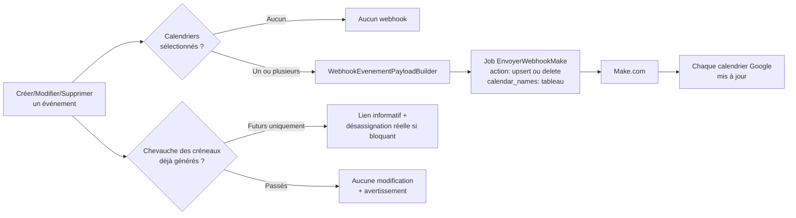

Voir [Intégration Make.com](#intégration-makecom-webhook) pour le format exact du payload.

---

### 🔄 Mes échanges (`/echanges`)

Liste des demandes d'échange de créneau envoyées et reçues par le membre connecté. Accessible depuis la barre latérale (avec badge du nombre de demandes en attente) et depuis « Mon planning ».

Chaque carte affiche les deux créneaux concernés (le sien et celui de l'autre membre), le statut (`en_attente`, `accepté`, `refusé`, `expiré`, `annulé`), et — si la personne connectée est le demandeur d'une demande encore en attente — un bouton pour l'annuler.

Voir [Échanges de créneaux](#échanges-de-créneaux) pour le détail du fonctionnement.

---

### ⚙️ Paramètres (`/parametres`)

Configuration de l'application (admin/gestionnaire, avec restrictions selon le rôle).

**Sections :**

| Section               | Modifiable par       | Description                                                                  |
| --------------------- | -------------------- | ---------------------------------------------------------------------------- |
| Inscriptions ouvertes | Admin uniquement     | Active ou désactive le formulaire public `/inscription`                      |
| Heure du cours & Lieu | Admin + Gestionnaire | Heure de référence pour les horaires webhook ; adresse physique              |
| Calendriers Google    | Admin + Gestionnaire | Nom exact du calendrier Google Calendar cible par tâche/événement (planning) |
| Décalages des tâches  | Admin + Gestionnaire | Offsets en minutes (positif = après le cours, négatif = avant)               |

> Tous ces paramètres sont stockés dans `ref_settings` et lus dynamiquement — il n'y a pas de valeur en `.env` pour ces réglages.
>
> Ne pas confondre avec le champ **« Calendriers Google Calendar »** (sélection multiple) du formulaire d'un événement organisationnel individuel (`/evenements/creer`) — ceux-ci sont stockés directement sur l'événement dans `ref_evenements_calendriers` (un événement peut avoir plusieurs calendriers), pas dans `ref_settings`.

---

### 👥 Personnes (`/personnes`)

CRUD complet des membres et bénévoles (admin uniquement).

**Statuts possibles :**

| Statut       | Signification                           |
| ------------ | --------------------------------------- |
| `En attente` | Candidature soumise, pas encore validée |
| `Validé`     | Membre actif, inclus dans le planning   |
| `Suspendu`   | Temporairement désactivé                |
| `Archivé`    | Inactif, exclu du planning              |

---

### 📥 Candidatures (`/admin/candidatures`)

Tableau de bord des inscriptions en attente de validation.

**Flux de validation :**

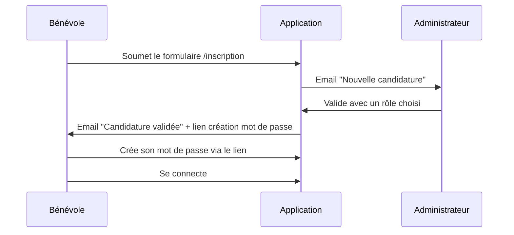

**Actions disponibles :**

- **Valider** : choisir le rôle (admin / gestionnaire / membre), passe le statut à `Validé`, envoie l'email d'invitation
- **Refuser** : passe le statut à `Archivé`
- **Renvoyer l'invitation** : renvoie l'email avec un nouveau lien de création de mot de passe

> **Note :** si la personne possède déjà un mot de passe (compte existant sur une autre app AMANA), l'email envoyé est différent — il lui indique de se connecter directement avec son mot de passe habituel, sans lien de reset.

---

### 🔄 Gestion des échanges (`/admin/echanges`)

Page réservée aux admins/gestionnaires listant **toutes** les demandes d'échange de créneau (tous membres confondus), triées avec les demandes `en_attente` en premier. Un badge dans la sidebar indique le nombre de demandes en attente.

**Actions disponibles sur une demande en attente :**

- **✅ Approuver** : exécute immédiatement l'échange, sans attendre la réponse de la personne cible. Cette action **prend le pas** sur le processus d'acceptation normal — si la personne cible clique ensuite sur son lien email, elle verra que l'échange n'est plus en attente.
- **✕ Refuser** : refuse la demande, notifie le demandeur. Équivalent à un refus de la personne cible, mais initié par un admin/gestionnaire.

Voir [Échanges de créneaux](#échanges-de-créneaux) pour le détail complet du flux.

---

## Gestion des utilisateurs

### Création d'un compte (3 chemins possibles)

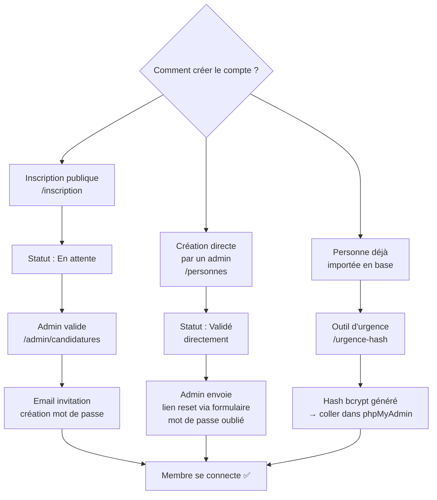

> Le formulaire public `/inscription` peut être désactivé par un administrateur via **Paramètres → Inscriptions ouvertes**. Lorsqu'il est fermé, la page affiche une redirection vers la connexion.

### Réinitialisation du mot de passe — cas normaux

En fonctionnement normal (emails SMTP opérationnels) :

1. L'utilisateur clique sur **Mot de passe oublié** depuis la page de connexion.
2. Il reçoit un lien de réinitialisation valable **60 minutes**.
3. Il définit son nouveau mot de passe via le formulaire `/nouveau-mot-de-passe/{token}`.

Pour renvoyer manuellement un lien à un utilisateur depuis l'interface admin, aller dans **Candidatures → Renvoyer l'invitation**.

### Outil d'urgence post-déploiement — `/urgence-hash`

Sur IONOS Deploy Now, il n'y a **pas de SSH interactif** et `php artisan tinker` (mode interactif) est inaccessible. Si les emails ne fonctionnent pas encore au premier déploiement, il est impossible de recevoir un lien de réinitialisation. L'outil `/urgence-hash` résout ce problème.

#### Principe

L'outil génère un **hash bcrypt** à partir d'un mot de passe saisi dans le navigateur, puis affiche la requête SQL prête à exécuter dans **phpMyAdmin**. Il ne modifie rien en base de données — c'est l'administrateur qui applique la requête manuellement.

#### Activation

Ajouter la variable suivante dans le `.env` sur IONOS (via le panneau Deploy Now ou SFTP) :

```env
APP_EMERGENCY_KEY=une-cle-secrete-tres-longue-et-aleatoire
```

La route est **entièrement désactivée** (retourne HTTP 404) si `APP_EMERGENCY_KEY` est absent ou vide. Elle ne nécessite aucune authentification — la clé secrète dans l'URL en tient lieu.

#### Utilisation

1. Visiter `https://votredomaine.com/urgence-hash?key=une-cle-secrete-tres-longue-et-aleatoire`
2. Saisir le nouveau mot de passe (8 caractères minimum) et le confirmer.
3. Cliquer sur **Générer le hash bcrypt**.
4. La page affiche le hash et la requête SQL suivante (cliquer pour copier) :

```sql
UPDATE ref_personnes
SET password = '$2y$12$...(hash généré)...'
WHERE email = 'votre@email.com';
```

1. Exécuter cette requête dans **phpMyAdmin** sur la base de données de production.
2. Se connecter normalement sur `/login`.

#### Désactivation après usage

⚠️ **Retirer la clé après utilisation** pour fermer la trappe d'urgence :

```env
# Supprimer ou vider cette ligne dans le .env IONOS :
APP_EMERGENCY_KEY=
```

Puis redéployer ou vider le cache de configuration :

```bash
php artisan config:cache
```

### Commande planifiée — expiration des échanges

```bash
# Exécutée automatiquement chaque jour à 01h00 via le scheduler Laravel
# (routes/console.php : Schedule::command('amana:expire-echanges')->dailyAt('01:00'))
php artisan amana:expire-echanges
```

Marque `expire` toute demande d'échange (`plan_echanges`) `en_attente` dont la date du créneau du demandeur est dépassée, et notifie le demandeur par email. Nécessite que le cron du scheduler Laravel tourne sur le serveur :

```bash
* * * * * cd /chemin/vers/app && php artisan schedule:run >> /dev/null 2>&1
```

---

## Algorithme de génération du planning

### Vue d'ensemble

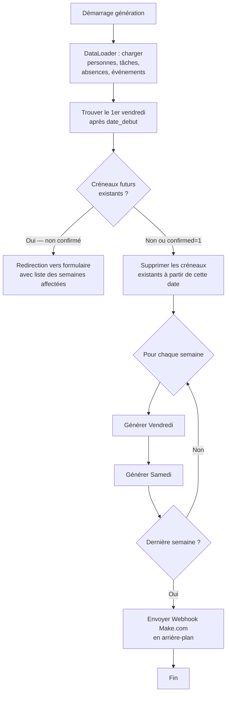

> ⚠️ L'étape **D** (suppression des créneaux existants) supprime en cascade tout échange `plan_echanges` lié à ces créneaux, quel que soit son statut. Vérifier `/admin/echanges` avant une régénération qui couvre une période avec des échanges `en_attente`.

### Mode dry-run (prévisualisation)

Lorsque `SchedulerMain::generateSchedule` est appelé avec `dryRun: true` (depuis `PlanningController::preview`) :

- Les créneaux existants **ne sont pas supprimés**
- L'algorithme s'exécute normalement mais dans une **transaction DB**
- La transaction est **rollbackée** à la fin — aucune donnée n'est persistée
- Le retour contient le tableau des propositions d'assignation par jour, affiché dans `planning/preview.blade.php`
- Aucun webhook n'est dispatché

```mermaid
flowchart LR
    A[Bouton Aperçu] --> B[POST /planning/generer/apercu]
    B --> C[SchedulerMain::generateSchedule\ndryRun=true]
    C --> D[DB::beginTransaction]
    D --> E[Calcul complet des assignations]
    E --> F[DB::rollBack]
    F --> G[Vue preview — non enregistré]
    G -->|Confirmer| H[POST /planning/generer\nconfirmed=1]
    H --> I[Génération réelle]
```

### Pour chaque jour (vendredi ou samedi)

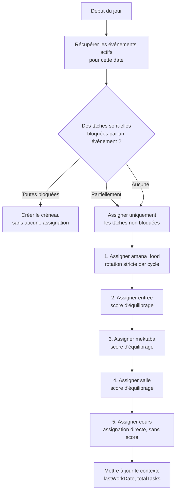

### Algorithme Amana Food (rotation stricte)

La tâche `amana_food` utilise un cycle global indépendant du jour de la semaine. L'objectif est que chaque personne éligible passe le même nombre de fois.

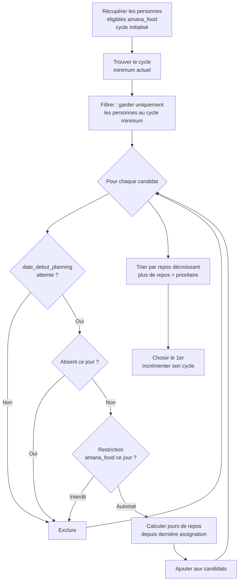

**Exemple :** si Alice est à 3 cycles et Bob à 4, c'est au tour d'Alice. Si plusieurs personnes sont au même cycle minimum, c'est celle qui n'a pas travaillé depuis le plus longtemps qui passe.

### Algorithme autres tâches (score d'équilibrage)

Pour `entree`, `mektaba` et `salle`, un score est calculé pour chaque candidat. **Le score le plus bas est prioritaire.**

```txt
Score = (total_assignations × 10) - (jours_de_repos × 1) + (nb_fois_cette_tâche × multiplicateur)
```

**Multiplicateur adaptatif** selon le nombre d'options disponibles de la personne :

| Options disponibles | Multiplicateur | Effet                                |
| ------------------- | -------------- | ------------------------------------ |
| ≥ 8                 | × 80           | Forte pénalité si répétition         |
| ≥ 6                 | × 60           | Pénalité élevée                      |
| ≥ 4                 | × 40           | Pénalité modérée                     |
| < 4                 | × 20           | Pénalité faible (peu d'alternatives) |

> **Pourquoi ce multiplicateur ?** Une personne avec peu d'options (ex : autorisée sur seulement 2 tâches) sera inévitablement répétée plus souvent sur ces tâches. Le multiplicateur réduit la pénalité pour ne pas la désavantager par rapport à des membres plus polyvalents.

**Règle anti-doublon :** une personne déjà assignée à une tâche dans le même créneau ne peut pas être assignée à une autre tâche du même jour. Cette règle **ne s'applique pas à `cours`** (voir ci-dessous).

#### `jours_de_repos` : exclusion des absences + plafond (retour de congé)

`jours_de_repos` n'est **pas** un simple nombre de jours calendaires depuis la dernière tâche (`RotationEngine::calculerJoursRepos()`). Deux correctifs évitent qu'un retour d'absence ne se traduise par une sur-sollicitation agressive de la personne concernée, le temps qu'elle "rattrape" son `totalTasks` :

- **Les jours d'absence ne comptent pas comme repos mérité.** Ils sont soustraits du décompte : la personne n'était pas disponible, ce n'est pas un choix de repos qui doit lui donner un avantage au retour.
- **Un plafond de 21 jours (`MAX_JOURS_REPOS`)** borne malgré tout l'avantage de score accordé à un retour, qu'il ait duré 3 semaines ou 6 mois. Passé ce plafond, une absence plus longue ne donne **pas** un avantage de score supplémentaire.

> ⚠️ Ce plafond **ne limite en rien la durée d'une absence** — une personne peut être absente aussi longtemps que nécessaire (`plan_absences` n'a pas de limite). Il plafonne uniquement la priorité de re-sélection accordée à son retour, pour que la reprise reste progressive plutôt qu'un rattrapage brutal sur plusieurs semaines.

### Algorithme `cours` (exception — assignation directe, sans score)

Par convention métier, **une seule personne** anime le `cours` chaque semaine : toutes les autres personnes sont explicitement interdites sur cette tâche via `ref_restrictions` (voir `TestPersonnesSeeder`, section "seule autorisée sur cours"). Faire passer `cours` par le score d'équilibrage ci-dessus poserait deux problèmes :

- la pénalité adaptative sur `nb_fois_cette_tâche` grimperait semaine après semaine pour la personne du cours, et finirait — à tort — par faire gagner quelqu'un d'autre au score ;
- la règle anti-doublon pourrait l'exclure du cours un jour où elle a déjà été assignée à `entree`/`mektaba`/`salle`/`amana_food`, laissant le cours sans personne.

`cours` a donc sa propre méthode d'assignation (`RotationEngine::assignCours()`) :

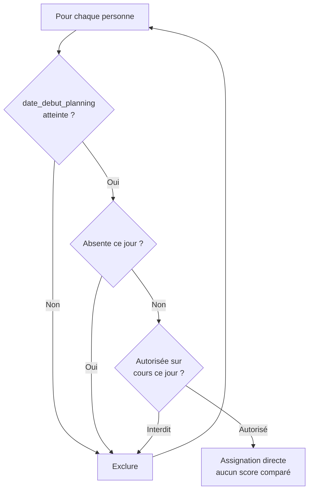

- **Aucun score n'est calculé** : le premier candidat autorisé par restriction (et disponible) est retenu directement, quel que soit son nombre d'assignations passées.
- **La règle anti-doublon est ignorée pour `cours`** : la personne peut cumuler `cours` avec une autre tâche le même jour, et une autre tâche du jour ne peut pas lui être retirée à cause du cours.
- Le compteur `totalTasks`/`lastWorkDate` de la personne est tout de même mis à jour après le jour (comme pour toute autre tâche), afin de garder un historique fidèle — voir aussi la section [Statistiques](#-statistiques-planningstats) pour l'effet de `cours` sur le score d'équité affiché.

### Initialisation du contexte depuis l'historique

Avant de générer, l'algorithme charge **tout l'historique** de la base de données pour initialiser les compteurs :

- `lastWorkDate` : dernière date de travail par personne
- `totalTasks` : nombre total d'assignations par personne
- `taskHistory` : nombre de fois qu'une personne a fait chaque tâche
- `amanaFoodCycles` : cycle actuel de chaque personne éligible à amana_food

Cela garantit une continuité parfaite d'une génération à l'autre.

> Un échange de créneau accepté (`plan_echanges.statut = accepte`) modifie directement `plan_creneaux_taches` — l'historique chargé à la prochaine génération reflète donc automatiquement le résultat de l'échange, sans logique additionnelle.

---

## Export PDF

Le PDF est généré à la demande via le formulaire `/planning/export`. Il utilise DomPDF avec :

- Format A4 paysage
- En-tête avec logo AMANA et plage de dates
- Tableau par semaine avec toutes les tâches
- Indication des événements et créneaux bloqués
- Police DejaVu Sans (support caractères spéciaux)

---

## Système de notifications

Toutes les notifications sont envoyées de manière **asynchrone** (via la queue) pour ne pas bloquer la réponse HTTP.

| Déclencheur                           | Destinataire                   | Email                                                    |
| ------------------------------------- | ------------------------------ | -------------------------------------------------------- |
| Nouvelle inscription                  | Tous les admins                | « Nouvelle candidature » avec fiche complète du candidat |
| Candidature validée (nouveau membre)  | Le candidat                    | « Bienvenue » + lien création mot de passe               |
| Candidature validée (compte existant) | Le candidat                    | « Votre accès est activé » + lien de connexion directe   |
| Demande d'échange créée               | La personne cible (B)          | « Demande d'échange » + liens Accepter/Refuser tokenisés |
| Échange accepté / exécuté             | Demandeur (A) **et** cible (B) | « Échange confirmé » avec récapitulatif avant/après      |
| Échange refusé                        | Demandeur (A)                  | « Échange refusé »                                       |
| Échange expiré (aucune réponse)       | Demandeur (A)                  | « Échange expiré »                                       |
| Échange annulé par le demandeur       | Cible (B)                      | « Demande annulée »                                      |

Toutes les notifications d'échange sont implémentées comme classes `App\Notifications\Echanges\*` (namespace dédié), chacune `ShouldQueue`.

---

## Échanges de créneaux

Un membre assigné à un créneau futur peut demander à l'échanger avec celui d'un autre membre assigné à **la même tâche**. L'échange ne devient effectif qu'après acceptation de la personne cible (ou approbation d'un admin/gestionnaire qui prend le pas sur cette attente).

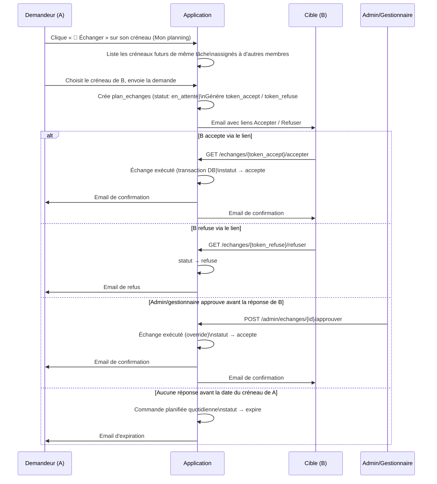

### Règles métier

- **Slots échangeables** : seuls les créneaux **futurs**, déjà assignés, sur la **même tâche** (même `code` dans `ref_taches`), appartenant à une personne différente du demandeur, et non déjà impliqués dans un autre échange `en_attente`, sont proposés.
- **Expiration** : la date limite de réponse correspond à la **date du créneau du demandeur** (fin de journée). Passé ce délai sans réponse, la demande expire automatiquement (commande planifiée `amana:expire-echanges`, exécutée quotidiennement).
- **Override admin/gestionnaire** : à tout moment pendant qu'une demande est `en_attente`, un admin ou gestionnaire peut l'approuver ou la refuser directement depuis `/admin/echanges`, sans attendre la réponse de la personne cible. L'approbation admin **prend le pas** sur l'attente de B.
- **Tokens à usage unique** : une fois l'échange dans un statut terminal (`accepte`, `refuse`, `expire`, `annule`), les liens email ne déclenchent plus aucune action — ils affichent une page indiquant que la demande n'est plus valide.
- **Pas de réutilisation de lien pour un nouvel échange** : si B souhaite à son tour échanger (y compris un swap retour vers A), il doit initier une **nouvelle demande** depuis son propre « Mon planning » — exactement le même processus que A a suivi.
- **Annulation par le demandeur** : A peut annuler sa propre demande tant qu'elle est `en_attente`, depuis `/echanges`. B est alors notifié que la demande a été annulée.
- **Audit** : chaque changement de statut (création, acceptation, refus, expiration, annulation) génère une entrée dans `audit_logs` (module `echanges`).
- **Hors scope** : si la personne cible B n'a **aucun créneau futur généré** sur la même tâche, il n'y a rien à échanger — aucune demande ne peut être créée dans ce cas. Une fonctionnalité de « priorité de réassignation à la prochaine génération » serait une feature distincte, non couverte ici.

### Tables et composants techniques

| Composant                                | Rôle                                                                                                                                            |
| ---------------------------------------- | ----------------------------------------------------------------------------------------------------------------------------------------------- |
| `plan_echanges` (table)                  | Stocke chaque demande d'échange et son cycle de vie complet (voir [Schema_bdd.md](docs/Schema_bdd.md))                                          |
| `App\Models\Echange`                     | Modèle Eloquent, relations vers `Personne`, `Creneau`, `Tache`                                                                                  |
| `App\Services\EchangeService`            | Toute la logique métier : calcul des slots échangeables, création, acceptation/refus par token, approbation/refus admin, annulation, expiration |
| `App\Http\Controllers\EchangeController` | Routes membres, routes tokenisées publiques, routes admin/gestionnaire                                                                          |
| `App\Console\Commands\ExpirerEchanges`   | Commande `amana:expire-echanges`, planifiée quotidiennement                                                                                     |
| `App\Notifications\Echanges\*`           | 5 notifications queued (demande, accepté, refusé, expiré, annulé)                                                                               |

### Routes Echanges

| Méthode | URL                              | Accès                  | Description                      |
| ------- | -------------------------------- | ---------------------- | -------------------------------- |
| GET     | `/echanges`                      | Membre connecté        | Mes échanges (envoyés + reçus)   |
| GET     | `/echanges/slots-disponibles`    | Membre connecté (AJAX) | Liste des slots échangeables     |
| POST    | `/echanges`                      | Membre connecté        | Créer une demande d'échange      |
| DELETE  | `/echanges/{id}`                 | Demandeur uniquement   | Annuler sa propre demande        |
| GET     | `/echanges/{token}/accepter`     | Public (lien email)    | B accepte l'échange              |
| GET     | `/echanges/{token}/refuser`      | Public (lien email)    | B refuse l'échange               |
| GET     | `/admin/echanges`                | Admin / Gestionnaire   | Liste de toutes les demandes     |
| POST    | `/admin/echanges/{id}/approuver` | Admin / Gestionnaire   | Approuver (override) une demande |
| POST    | `/admin/echanges/{id}/refuser`   | Admin / Gestionnaire   | Refuser une demande              |

> Les routes tokenisées sont **hors du middleware `auth`** car la personne cible clique sur le lien directement depuis son client email, sans être nécessairement connectée.

---

## Bilan quotidien

Suivi du bilan de chaque permanence : collecte Amana Food (carte bancaire / espèces) et effectifs (présents sur place / connectés en ligne). Accessible à **tous les membres connectés** — pas de restriction de rôle, ni de notion de propriétaire : un seul enregistrement partagé par date, modifiable par n'importe qui.

### 📋 Bilan du jour (`/bilan`)

- Sélection d'une date, saisie des montants et effectifs — enregistrement en un clic (`updateOrCreate`, upsert).
- Affiche la dernière personne à avoir modifié le bilan et la date de dernière mise à jour.

### 📊 Statistiques du bilan (`/bilan/statistiques`)

- Série temporelle sur une période choisie (montants, effectifs, taux de remplissage = nombre de bilans saisis / nombre de créneaux existants sur la période).
- Cartes de synthèse : montant total collecté, moyenne de présence, meilleure date (présence et collecte).
- Pour chaque date, retrouve automatiquement qui était responsable des tâches `amana_food` et `mektaba` ce jour-là (affiché dans les tooltips des graphiques).

### Routes Bilan

| Méthode | URL                        | Accès    | Description                                         |
| ------- | -------------------------- | -------- | --------------------------------------------------- |
| GET     | `/bilan`                   | Connecté | Vue de saisie du bilan quotidien                    |
| GET     | `/bilan/data?date=`        | Connecté | JSON — bilan existant pour une date (ou vide)       |
| POST    | `/bilan/data`              | Connecté | Enregistre (crée ou met à jour) le bilan d'une date |
| GET     | `/bilan/statistiques`      | Connecté | Vue statistiques                                    |
| GET     | `/bilan/statistiques/data` | Connecté | JSON — série + cartes de stats sur une période      |

Voir [docs/Schema_bdd.md](docs/Schema_bdd.md#plan_bilans_quotidiens) pour le détail de la table `plan_bilans_quotidiens`.

---

## Intégration Make.com (Webhook)

Après chaque génération de planning, modification manuelle d'une assignation, création/suppression d'un créneau, ou création/modification/suppression d'un événement synchronisé, l'application envoie un payload JSON à Make.com via un job asynchrone (`EnvoyerWebhookMake`). Make.com crée/modifie/supprime alors les événements Google Calendar correspondants.

> Le webhook n'est **pas** dispatché lors d'une prévisualisation dry-run.

**Variables `.env` concernées :**

```dotenv
MAKE_WEBHOOK_URL=https://hook.make.com/votre-identifiant
MAKE_WEBHOOK_APIKEY=votre-cle-api
```

Chaque appel inclut le header `x-make-apikey` (en plus de l'URL). Les deux doivent être configurées, sinon l'envoi est silencieusement ignoré (log d'avertissement).

> L'heure du cours n'est **plus** lue depuis `.env`. Elle est stockée dans `ref_settings` (clé `heure_cours`) et modifiable via la page Paramètres.

**Verbes HTTP par action :**

| Action                                                                              | Verbe    | Builder                                                                           |
| ----------------------------------------------------------------------------------- | -------- | --------------------------------------------------------------------------------- |
| Génération complète du planning                                                     | `POST`   | `WebhookPayloadBuilder::build()`                                                  |
| Création manuelle d'un créneau vide                                                 | `POST`   | `WebhookPayloadBuilder::buildForCreation()`                                       |
| Réassignation d'une tâche                                                           | `PATCH`  | `WebhookPayloadBuilder::buildForReassignation()`                                  |
| Désassignation d'une tâche                                                          | `DELETE` | `WebhookPayloadBuilder::buildForUnassignation()`                                  |
| Suppression d'un créneau entier                                                     | `DELETE` | `WebhookPayloadBuilder::buildForDeleteCreneau()`                                  |
| Événement organisationnel créé                                                      | `POST`   | `WebhookEvenementPayloadBuilder::buildUpsert()`                                   |
| Événement organisationnel modifié                                                   | `PATCH`  | `WebhookEvenementPayloadBuilder::buildUpsert()`                                   |
| Événement organisationnel supprimé                                                  | `DELETE` | `WebhookEvenementPayloadBuilder::buildDelete()`                                   |
| Désassignation rétroactive (événement créé/modifié bloquant un créneau déjà généré) | `DELETE` | `WebhookPayloadBuilder::buildForUnassignation()` (une fois par tâche désassignée) |
| Exécution d'un échange (swap validé)                                                | `PATCH`  | `WebhookPayloadBuilder::buildForEchange()`                                        |
| **Annulation cours** — nettoyage du calendrier existant                             | `DELETE` | `WebhookPayloadBuilder::buildForDeleteCreneau()`                                  |
| **Annulation cours** — annonce de l'annulation                                      | `POST`   | `WebhookPayloadBuilder::buildForAnnulationCours()`                                |

**Structure du payload planning** — racine strictement limitée à `lieu` + `creneaux` :

```json
{
    "lieu": "319 Rte de Vannes, 44800 Saint-Herblain, France",
    "creneaux": [
        {
            "date": "2026-08-06",
            "evenements": [{ "nom": "Ramadan", "description": "" }],
            "taches": [
                {
                    "nom": "Entrée",
                    "assigne": "Prénom Nom",
                    "email": "personne@exemple.fr",
                    "heure_debut": "19:30",
                    "heure_fin": "20:30",
                    "calendar_names": ["AMANA - Planning"],
                    "description": ""
                }
            ],
            "evenements_speciaux": [
                {
                    "nom": "Rappel Sandwich",
                    "assigne": "Prénom Nom",
                    "email": "personne@exemple.fr",
                    "heure_debut": "08:00",
                    "heure_fin": "08:15",
                    "calendar_names": ["AMANA - Planning"],
                    "description": ""
                }
            ],
            "evenements_sociaux": [
                {
                    "nom": "Annonce Cours",
                    "assigne": null,
                    "email": null,
                    "heure_debut": "14:00",
                    "heure_fin": "14:15",
                    "calendar_names": ["AMANA - Communications"],
                    "description": ""
                }
            ]
        }
    ]
}
```

**PATCH (réassignation d'une tâche)** — ne contient que la tâche modifiée (et l'événement spécial dépendant, le cas échéant) :

```json
{
    "lieu": "319 Rte de Vannes, 44800 Saint-Herblain, France",
    "creneaux": [
        {
            "date": "2026-08-06",
            "taches": [
                {
                    "nom": "Entrée",
                    "assigne": "Nouveau Nom",
                    "email": "nouveau@exemple.fr",
                    "heure_debut": "19:30",
                    "heure_fin": "20:30",
                    "calendar_names": ["AMANA - Planning"],
                    "description": ""
                }
            ],
            "evenements_speciaux": [
                {
                    "nom": "Assistance Amana Food",
                    "assigne": "Nouveau Nom",
                    "email": "nouveau@exemple.fr",
                    "heure_debut": "20:30",
                    "heure_fin": "21:30",
                    "calendar_names": ["AMANA - Planning"],
                    "description": ""
                }
            ]
        }
    ]
}
```

**PATCH (exécution d'un échange)** — toujours deux entrées `creneaux` (une par date), même si l'une des deux dates est désormais passée :

```json
{
    "lieu": "319 Rte de Vannes, 44800 Saint-Herblain, France",
    "creneaux": [
        {
            "date": "2026-08-06",
            "taches": [
                {
                    "nom": "Entrée",
                    "assigne": "Alice Dupont",
                    "email": "alice@exemple.fr",
                    "heure_debut": "19:30",
                    "heure_fin": "20:30",
                    "calendar_names": ["AMANA - Planning"],
                    "description": ""
                }
            ]
        },
        {
            "date": "2026-08-13",
            "taches": [
                {
                    "nom": "Entrée",
                    "assigne": "Bob Martin",
                    "email": "bob@exemple.fr",
                    "heure_debut": "19:30",
                    "heure_fin": "20:30",
                    "calendar_names": ["AMANA - Planning"],
                    "description": ""
                }
            ]
        }
    ]
}
```

**DELETE (désassignation d'une tâche)** — pas de `assigne`/`email`, uniquement de quoi localiser l'événement calendrier à supprimer :

```json
{
    "lieu": "319 Rte de Vannes, 44800 Saint-Herblain, France",
    "creneaux": [
        {
            "date": "2026-08-06",
            "taches": [
                {
                    "nom": "Entrée",
                    "heure_debut": "19:30",
                    "heure_fin": "20:30",
                    "calendar_names": ["AMANA - Planning"]
                }
            ]
        }
    ]
}
```

**DELETE (suppression d'un créneau entier)** — toutes les tâches/événements spéciaux/sociaux du jour, pour un nettoyage complet en un seul appel :

```json
{
    "lieu": "319 Rte de Vannes, 44800 Saint-Herblain, France",
    "creneaux": [
        {
            "date": "2026-08-06",
            "taches": [
                {
                    "nom": "Entrée",
                    "heure_debut": "19:30",
                    "heure_fin": "20:30",
                    "calendar_names": ["AMANA - Planning"]
                },
                {
                    "nom": "Mektaba",
                    "heure_debut": "19:40",
                    "heure_fin": "21:40",
                    "calendar_names": ["AMANA - Planning"]
                },
                {
                    "nom": "Salle",
                    "heure_debut": "20:00",
                    "heure_fin": "21:30",
                    "calendar_names": ["AMANA - Planning"]
                },
                {
                    "nom": "Amana Food",
                    "heure_debut": "20:30",
                    "heure_fin": "21:30",
                    "calendar_names": ["AMANA - Planning"]
                },
                {
                    "nom": "Cours",
                    "heure_debut": "20:00",
                    "heure_fin": "21:00",
                    "calendar_names": ["AMANA - Planning"]
                }
            ],
            "evenements_speciaux": [
                {
                    "nom": "Rappel Sandwich",
                    "heure_debut": "08:00",
                    "heure_fin": "08:15",
                    "calendar_names": ["AMANA - Planning"]
                },
                {
                    "nom": "Assistance Amana Food",
                    "heure_debut": "20:30",
                    "heure_fin": "21:30",
                    "calendar_names": ["AMANA - Planning"]
                }
            ],
            "evenements_sociaux": [
                {
                    "nom": "Annonce Cours",
                    "heure_debut": "14:00",
                    "heure_fin": "14:15",
                    "calendar_names": ["AMANA - Communications"]
                },
                {
                    "nom": "Message Général",
                    "heure_debut": "19:30",
                    "heure_fin": "20:00",
                    "calendar_names": ["AMANA - Communications"]
                }
            ]
        }
    ]
}
```

**POST (annulation cours)** — envoyée juste après le DELETE de nettoyage ci-dessus, avec exactement la même structure racine `lieu` + `creneaux` que n'importe quelle autre création (`taches` vide puisque toutes les tâches sont désormais bloquées, une seule entrée `evenements_sociaux` pour l'annonce) :

```json
{
    "lieu": "319 Rte de Vannes, 44800 Saint-Herblain, France",
    "creneaux": [
        {
            "date": "2026-08-06",
            "evenements": [
                { "nom": "Cours annulé — 6 août 2026", "description": "" }
            ],
            "taches": [],
            "evenements_speciaux": [],
            "evenements_sociaux": [
                {
                    "nom": "Annulation Cours",
                    "assigne": null,
                    "email": null,
                    "heure_debut": "14:00",
                    "heure_fin": "14:15",
                    "calendar_names": ["AMANA - Communications"],
                    "description": ""
                }
            ]
        }
    ]
}
```

**POST/PATCH (événement organisationnel créé ou modifié)** — racine distincte, `type: "evenement"` :

```json
{
    "type": "evenement",
    "action": "upsert",
    "genere_le": "2026-07-03T10:00:00+00:00",
    "evenement": {
        "id": 42,
        "nom": "Ramadan",
        "date_debut": "2025-03-01",
        "date_fin": "2025-03-30",
        "description": "",
        "calendar_names": ["AMANA - Événements", "AMANA - Communications"],
        "taches_bloquees": ["amana_food", "entree"],
        "informatif": false
    }
}
```

**DELETE (événement organisationnel supprimé)** :

```json
{
    "type": "evenement",
    "action": "delete",
    "genere_le": "2026-07-03T10:00:00+00:00",
    "evenement": {
        "id": 42,
        "nom": "Ramadan",
        "date_debut": "2025-03-01",
        "date_fin": "2025-03-30",
        "calendar_names": ["AMANA - Événements", "AMANA - Communications"]
    }
}
```

**Notes importantes sur le payload :**

- `taches`, `evenements_speciaux` et `evenements_sociaux` sont des **tableaux** (et non plus des objets indexés par code).
- `evenements` (niveau créneau) liste les événements organisationnels actifs ce jour-là (`nom` + `description` uniquement — pas d'horaires, un événement type Ramadan couvrant des jours entiers).
- Si une tâche est **bloquée par un événement**, elle est absente du payload (POST/PATCH/DELETE).
- `rappel_sandwich` a un horaire fixe (08:00–08:15) ; `assistance_amana_food` suit l'assigné de `entree` ; `rappel_sandwich` suit l'assigné de `amana_food` — ces dépendances sont propagées automatiquement dans les payloads PATCH/DELETE d'une réassignation/désassignation de `entree` ou `amana_food`.
- **`calendar_names` est toujours un tableau** (jamais une chaîne unique), y compris pour `taches`, `evenements_speciaux`, `evenements_sociaux` **et** le payload `evenement` séparé — même quand il ne contient qu'un seul nom aujourd'hui. Ce choix est volontairement prévu pour absorber, plus tard, plusieurs calendriers par tâche/événement social sans changer la forme du payload — seul le nombre d'éléments dans le tableau changerait. Un tableau vide `[]` signifie qu'aucun calendrier n'est configuré pour ce code (Make.com peut alors ignorer l'entrée ou utiliser un calendrier par défaut).
- Pour les **événements organisationnels** (`type: "evenement"`), `calendar_names` correspond à la liste des calendriers Google Calendar liés à l'événement (table `ref_evenements_calendriers`, un événement peut en avoir plusieurs) — indépendant des `calendar_names` des tâches du planning ci-dessus, qui viennent des paramètres (Paramètres → Calendriers).

---

## Déploiement — pipeline GitHub Actions → IONOS

Le déploiement est **automatisé** : chaque push sur la branche `tailwind` déclenche `.github/workflows/deploy.yaml`, qui build l'application (Composer + `npm run build`) puis la livre sur IONOS par SSH/rsync. Il n'y a **plus** de déploiement manuel par `git pull` sur le serveur.

➡️ **Documentation complète du pipeline** (étapes détaillées, secrets/variables GitHub requis, détection du premier déploiement, dépannage) : [docs/installation.md § Déploiement en production](docs/installation.md#déploiement-en-production--pipeline-github-actions--ionos).

Cette section couvre uniquement ce qui est spécifique à l'application une fois déployée.

### Variables `.env` de production

Rendues automatiquement par la CI à partir de `.github/deploy/.env.production.template` et des secrets/variables GitHub — **il n'y a pas de `.env` à éditer manuellement sur le serveur** en usage normal. Pour référence, voici les valeurs clés :

```env
APP_NAME="AMANA Planning"
APP_ENV=production
APP_DEBUG=false
APP_URL=https://votredomaine.com
APP_KEY=base64:...

DB_CONNECTION=mysql
DB_HOST=...
DB_PORT=3306
DB_DATABASE=...
DB_USERNAME=...
DB_PASSWORD=...

MAIL_MAILER=smtp
MAIL_SCHEME=                        # Laisser VIDE (pas "null") pour STARTTLS sur le port 587
MAIL_HOST=smtp.ionos.fr
MAIL_PORT=587
MAIL_USERNAME=no-reply@...
MAIL_PASSWORD=...
MAIL_FROM_ADDRESS=no-reply@...
MAIL_FROM_NAME="${APP_NAME}"

QUEUE_CONNECTION=sync               # Obligatoire sur hébergement partagé (pas de worker persistant)

MAKE_WEBHOOK_URL=https://hook.eu2.make.com/...
MAKE_WEBHOOK_APIKEY=...

# Outil d'urgence — retirer après usage
APP_EMERGENCY_KEY=
```

> ⚠️ **`MAIL_SCHEME=null`** (la chaîne littérale) est une erreur fréquente. Sur IONOS avec le port 587 (STARTTLS), la valeur doit être **vide** (`MAIL_SCHEME=`) ou absente du `.env`. La valeur `null` en texte perturbe Symfony Mailer et bloque silencieusement l'envoi des emails.

### Checklist premier déploiement

| Étape | Action                                                     | Vérification                                                                                                               |
| ----- | ---------------------------------------------------------- | -------------------------------------------------------------------------------------------------------------------------- |
| 1     | Définir tous les secrets/variables GitHub requis           | Voir [docs/installation.md § Configuration requise](docs/installation.md#configuration-requise--secrets--variables-github) |
| 2     | Déployer via GitHub Actions (push sur `tailwind`)          | Pipeline vert dans l'onglet **Actions** de GitHub                                                                          |
| 3     | Vérifier que la migration s'est exécutée                   | Aller dans phpMyAdmin — les tables existent (`migrate:fresh --seed` au premier déploiement)                                |
| 4     | Définir le mot de passe du premier admin                   | Voir [Outil d'urgence `/urgence-hash`](#outil-durgence-post-déploiement----urgence-hash)                                   |
| 5     | Se connecter et aller sur **Diagnostic SMTP**              | Sidebar → 🔧 Diagnostic SMTP                                                                                               |
| 6     | Envoyer un email de test depuis le diagnostic              | Vérifier la réception + `laravel.log`                                                                                      |
| 7     | Configurer les paramètres (heure, lieu, calendriers)       | `/parametres`                                                                                                              |
| 8     | Retirer le secret `APP_EMERGENCY_KEY` (vide) et redéployer | Le champ `?key=` de `/urgence-hash` ne doit plus fonctionner                                                               |

### Diagnostic SMTP — `/diagnostic-mail`

Accessible depuis la sidebar (section **Administration**, admins uniquement). Permet de :

- Voir la configuration SMTP active lue depuis le cache de config (pas depuis `.env` directement).
- Détecter des problèmes courants comme `MAIL_SCHEME=null`.
- Envoyer un email de test vers n'importe quelle adresse et voir le résultat immédiatement.
- Consulter `storage/logs/laravel.log` pour le détail de chaque tentative.

### Sélection des calendriers Google Calendar

Les champs **Calendriers** dans `/parametres` et dans le formulaire de création/modification d'événement ne sont plus des champs texte libres. Ils affichent désormais un **dropdown avec barre de recherche** qui récupère la liste des calendriers disponibles directement depuis Make.com (GET sur le webhook configuré dans `MAKE_WEBHOOK_URL`).

La liste est mise en cache côté navigateur pendant la durée de la session. En cas d'échec de l'appel Make.com (webhook non configuré, timeout), un message d'erreur s'affiche dans le dropdown — les valeurs déjà enregistrées restent inchangées.

### Contraintes de l'hébergement partagé IONOS

| Contrainte                                | Impact                                                      | Contournement                                                                                                         |
| ----------------------------------------- | ----------------------------------------------------------- | --------------------------------------------------------------------------------------------------------------------- |
| SSH réservé au déploiement automatisé     | Pas de session interactive pratique pour du débogage ad hoc | `php artisan tinker` reste possible en SSH mais n'est pas le flux normal ; outil `/urgence-hash` pour les hash bcrypt |
| Pas de worker de queue persistant         | Les jobs `ShouldQueue` doivent s'exécuter immédiatement     | `QUEUE_CONNECTION=sync` dans `.env`                                                                                   |
| Logs serveur séparés de Laravel           | `access.log.*` ≠ `laravel.log`                              | Lire `storage/logs/laravel.log` via SFTP ou phpMyAdmin                                                                |
| `storage/` exclu du déploiement récurrent | Le dossier est préservé entre déploiements                  | `rsync` exclut explicitement `storage/` dans le job `deploy` du pipeline                                              |
