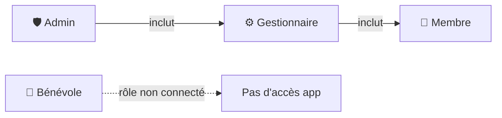
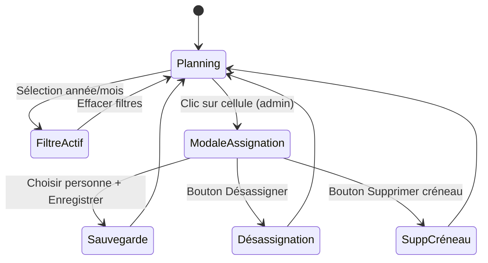
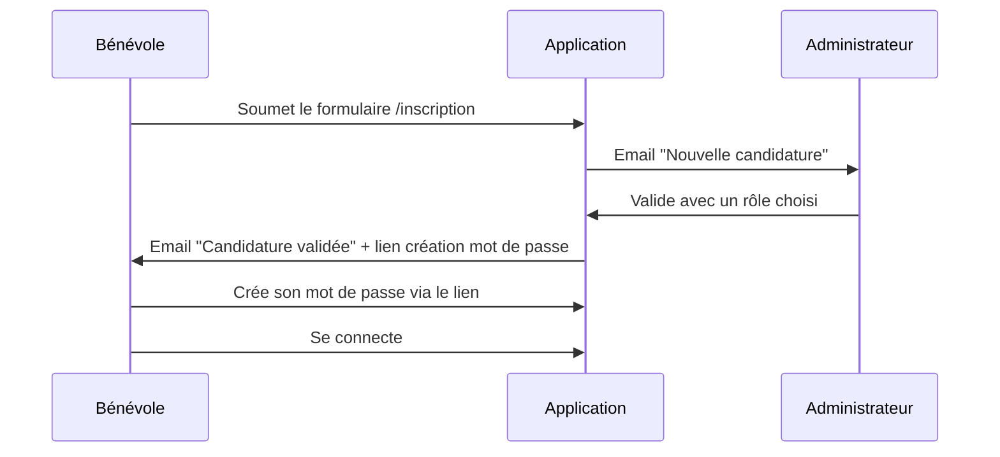
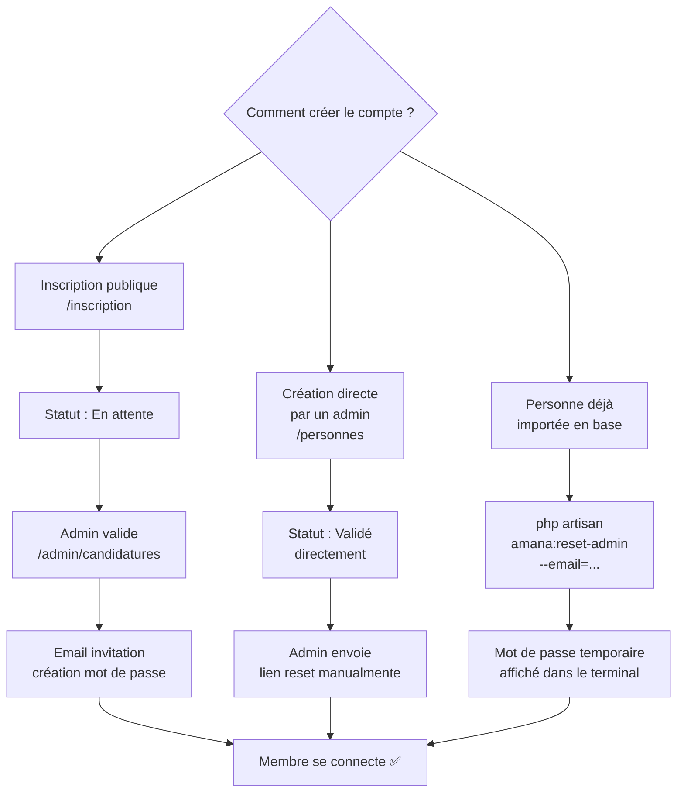
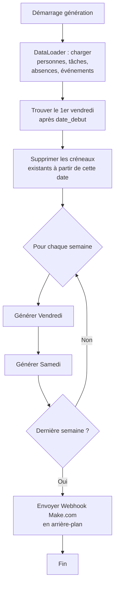
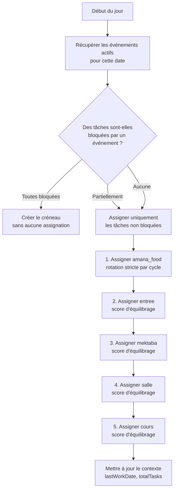
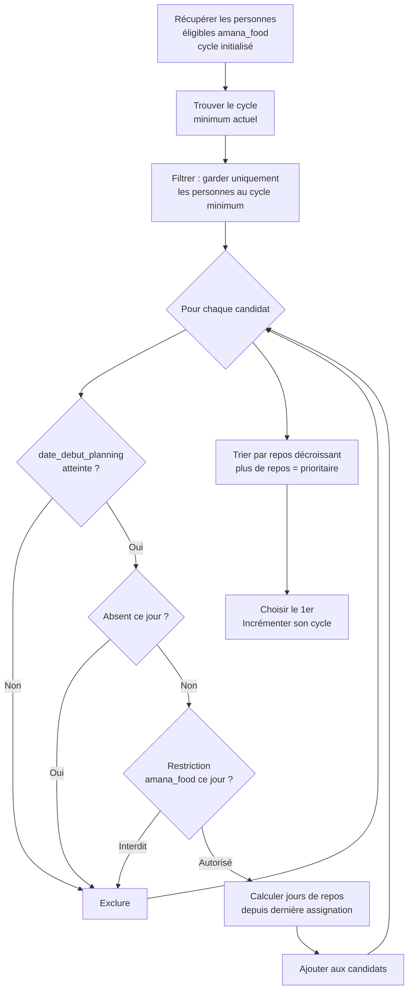

# AMANA Planning — Documentation complète

## Table des matières

1. [Présentation du projet](#présentation-du-projet)
2. [Architecture technique](#architecture-technique)
3. [Rôles et permissions](#rôles-et-permissions)
4. [Vues et fonctionnalités](#vues-et-fonctionnalités)
5. [Gestion des utilisateurs](#gestion-des-utilisateurs)
6. [Algorithme de génération du planning](#algorithme-de-génération-du-planning)
7. [Export PDF](#export-pdf)
8. [Système de notifications](#système-de-notifications)
9. [Intégration Make.com (Webhook)](#intégration-makecom-webhook)

---

## Présentation du projet

AMANA Planning est une application web de gestion des permanences hebdomadaires de l'association AMANA. Elle automatise la répartition équitable des tâches entre les membres bénévoles, chaque vendredi et samedi soir.

**Tâches planifiées :**

| Code         | Libellé    | Description                                      |
| ------------ | ---------- | ------------------------------------------------ |
| `entree`     | Entrée     | Accueil des bénéficiaires à l'entrée             |
| `mektaba`    | Mektaba    | Gestion de la bibliothèque / espace documentaire |
| `salle`      | Salle      | Préparation et rangement de la salle             |
| `amana_food` | Amana Food | Distribution alimentaire                         |
| `cours`      | Cours      | Animation du cours du soir                       |

---

## Architecture technique


**Stack :**

- **Backend :** Laravel 11 (PHP 8.2+)
- **Base de données :** MySQL 8 / MariaDB 10.4+
- **Frontend :** Blade + CSS custom (pas de framework JS)
- **PDF :** barryvdh/laravel-dompdf
- **Queue :** Laravel Queue (driver database)
- **Automatisation externe :** Make.com via webhook

---

## Rôles et permissions

L'application définit quatre rôles dans l'application `planning`. Chaque personne ne peut avoir qu'un seul rôle à la fois.



### Tableau des accès

| Fonctionnalité                            | Admin | Gestionnaire |    Membre    |
| ----------------------------------------- | :---: | :----------: | :----------: |
| Voir le planning                          |  ✅   |      ✅      |      ✅      |
| Voir les statistiques                     |  ✅   |      ✅      |      ✅      |
| Export PDF                                |  ✅   |      ✅      |      ✅      |
| Voir les absences                         |  ✅   |      ✅      |      ✅      |
| Ajouter/supprimer ses absences            |  ✅   |      ✅      |      ✅      |
| Ajouter/supprimer toutes les absences     |  ✅   |      ✅      |      ❌      |
| Voir les disponibilités (grille complète) |  ✅   |      ✅      | ✅ (lecture) |
| Modifier ses disponibilités               |  ✅   |      ✅      |      ✅      |
| Modifier toutes les disponibilités        |  ✅   |      ✅      |      ❌      |
| Générer le planning                       |  ✅   |      ✅      |      ❌      |
| Modifier le planning manuellement         |  ✅   |      ✅      |      ❌      |
| Rollback (annuler une génération)         |  ✅   |      ✅      |      ❌      |
| Créer / modifier les événements           |  ✅   |      ✅      |      ❌      |
| Voir les événements                       |  ✅   |      ✅      |      ✅      |
| Paramètres de l'application               |  ✅   |      ✅      |      ❌      |
| Gérer les personnes (CRUD)                |  ✅   |      ❌      |      ❌      |
| Valider / refuser les candidatures        |  ✅   |      ❌      |      ❌      |

---

## Vues et fonctionnalités

### 🏠 Planning (`/planning`)

Vue principale de l'application. Affiche les créneaux regroupés par semaine ISO, du plus récent au plus ancien.

**Fonctionnalités :**

- Filtre par année et par mois (filtre par défaut : mois courant + mois précédent)
- Bannières informatives par semaine pour les événements
- Clic sur une cellule → modale de réassignation (admin/gestionnaire)
- Bouton « + Créneau » pour ajouter manuellement un jour (admin/gestionnaire)
- Suppression d'un créneau ou d'une semaine entière (admin/gestionnaire)
- Toasts de confirmation en temps réel (AJAX)



---

### ✨ Générer le planning (`/planning/generer`)

Formulaire de génération automatique du planning.

**Paramètres :**

- Date de début (le premier vendredi suivant cette date sera utilisé)
- Nombre de semaines (1 à 52)

**Aperçu dynamique** : le formulaire calcule et affiche en temps réel les dates concernées avant soumission.

**Rollback** : après chaque génération, un panneau de rollback apparaît permettant d'annuler tout ou partie des créneaux générés (par semaine). La session de rollback est conservée jusqu'à fermeture explicite.

---

### 📊 Statistiques (`/planning/stats`)

Tableau de bord de l'équité de la répartition.

**Métriques affichées :**

- Score d'équité global (0–100)
- Écart-type et coefficient de variation
- Déséquilibre vendredi/samedi
- Distribution Amana Food (min/max/moy)
- Jours consécutifs maximum
- Détail par personne : total, vendredis, samedis, chaque tâche, absences

---

### 📄 Export PDF (`/planning/export`)

Génère un fichier PDF du planning sur une plage de dates, au format A4 paysage.

---

### 🏖️ Absences (`/absences`)

Gestion des périodes d'absence. Une absence empêche l'assignation d'une personne pendant la période concernée lors de la génération du planning.

**Règles d'accès :**

- Tout le monde peut voir toutes les absences
- Un membre ne peut ajouter/supprimer que ses propres absences
- Admin/gestionnaire peut gérer les absences de tout le monde

---

### 🔒 Disponibilités (`/restrictions`)

Grille de disponibilité par personne, tâche et jour (Vendredi / Samedi).

- **Case cochée** = la personne peut effectuer la tâche ce jour-là
- **Case décochée** = la personne est indisponible pour cette tâche ce jour-là

**Cas d'usage typique :** pour la tâche `cours`, cocher uniquement la personne désignée pour animer le cours, et décocher tous les autres.

Admin/gestionnaire voient la grille complète modifiable. Les membres voient la grille en lecture seule et disposent d'un formulaire pour modifier uniquement leurs propres disponibilités.

---

### 🎉 Événements (`/evenements`)

Les événements organisationnels (vacances, Ramadan, conférences…) peuvent bloquer certaines tâches lors de la génération.

**Deux types :**

| Type                                           | Comportement                                                                              |
| ---------------------------------------------- | ----------------------------------------------------------------------------------------- |
| **Informatif** (aucune tâche cochée)           | Affiche une bannière dans le planning, n'affecte pas les assignations                     |
| **Bloquant** (une ou plusieurs tâches cochées) | Les tâches sélectionnées ne sont pas assignées pour les créneaux couverts par l'événement |

---

### ⚙️ Paramètres (`/parametres`)

Configuration de l'application (admin/gestionnaire uniquement) :

- **Heure du cours** : heure de référence pour le calcul des horaires webhook
- **Lieu** : adresse des permanences, incluse dans le payload webhook
- **Décalages des tâches** : offsets en minutes (positif = après le cours, négatif = avant) pour chaque tâche, utilisés par Make.com pour créer les événements Google Calendar

---

### 👥 Personnes (`/personnes`)

CRUD complet des membres et bénévoles (admin uniquement).

**Statuts possibles :**

| Statut       | Signification                           |
| ------------ | --------------------------------------- |
| `En attente` | Candidature soumise, pas encore validée |
| `Validé`     | Membre actif, inclus dans le planning   |
| `Suspendu`   | Temporairement désactivé                |
| `Archivé`    | Inactif, exclu du planning              |

---

### 📥 Candidatures (`/admin/candidatures`)

Tableau de bord des inscriptions en attente de validation.

**Flux de validation :**



**Actions disponibles :**

- **Valider** : choisir le rôle (admin / gestionnaire / membre), passe le statut à `Validé`, envoie l'email d'invitation
- **Refuser** : passe le statut à `Archivé`
- **Renvoyer l'invitation** : renvoie l'email avec un nouveau lien de création de mot de passe

---

## Gestion des utilisateurs

### Création d'un compte (3 chemins possibles)



### Commande de secours

```bash
# Réinitialiser/créer un compte admin via SSH
php artisan amana:reset-admin

# Avec un email spécifique
php artisan amana:reset-admin --email=mon@email.fr

# Avec un mot de passe prédéfini
php artisan amana:reset-admin --email=mon@email.fr --password=NouveauMotDePasse!
```

---

## Algorithme de génération du planning

### Vue d'ensemble



### Pour chaque jour (vendredi ou samedi)



### Algorithme Amana Food (rotation stricte)

La tâche `amana_food` utilise un cycle global indépendant du jour de la semaine. L'objectif est que chaque personne éligible passe le même nombre de fois.



**Exemple :** si Alice est à 3 cycles et Bob à 4, c'est au tour d'Alice. Si plusieurs personnes sont au même cycle minimum, c'est celle qui n'a pas travaillé depuis le plus longtemps qui passe.

### Algorithme autres tâches (score d'équilibrage)

Pour `entree`, `mektaba`, `salle` et `cours`, un score est calculé pour chaque candidat. **Le score le plus bas est prioritaire.**

```
Score = (total_assignations × 10) - (jours_de_repos × 1) + (nb_fois_cette_tâche × multiplicateur)
```

**Multiplicateur adaptatif** selon le nombre d'options disponibles de la personne :

| Options disponibles | Multiplicateur | Effet                                |
| ------------------- | -------------- | ------------------------------------ |
| ≥ 8                 | × 80           | Forte pénalité si répétition         |
| ≥ 6                 | × 60           | Pénalité élevée                      |
| ≥ 4                 | × 40           | Pénalité modérée                     |
| < 4                 | × 20           | Pénalité faible (peu d'alternatives) |

> **Pourquoi ce multiplicateur ?** Une personne avec peu d'options (ex : autorisée sur seulement 2 tâches) sera inévitablement répétée plus souvent sur ces tâches. Le multiplicateur réduit la pénalité pour ne pas la désavantager par rapport à des membres plus polyvalents.

**Règle anti-doublon :** une personne déjà assignée à une tâche dans le même créneau ne peut pas être assignée à une autre tâche du même jour.

### Initialisation du contexte depuis l'historique

Avant de générer, l'algorithme charge **tout l'historique** de la base de données pour initialiser les compteurs :

- `lastWorkDate` : dernière date de travail par personne
- `totalTasks` : nombre total d'assignations par personne
- `taskHistory` : nombre de fois qu'une personne a fait chaque tâche
- `amanaFoodCycles` : cycle actuel de chaque personne éligible à amana_food

Cela garantit une continuité parfaite d'une génération à l'autre.

---

## Export PDF

Le PDF est généré à la demande via le formulaire `/planning/export`. Il utilise DomPDF avec :

- Format A4 paysage
- En-tête avec logo AMANA et plage de dates
- Tableau par semaine avec toutes les tâches
- Indication des événements et créneaux bloqués
- Police DejaVu Sans (support caractères spéciaux)

---

## Système de notifications

Toutes les notifications sont envoyées de manière **asynchrone** (via la queue) pour ne pas bloquer la réponse HTTP.

| Déclencheur                           | Destinataire    | Email                                                    |
| ------------------------------------- | --------------- | -------------------------------------------------------- |
| Nouvelle inscription                  | Tous les admins | « Nouvelle candidature » avec fiche complète du candidat |
| Candidature validée (nouveau membre)  | Le candidat     | « Bienvenue » + lien création mot de passe               |
| Candidature validée (compte existant) | Le candidat     | « Votre accès est activé » + lien de connexion directe   |

---

## Intégration Make.com (Webhook)

Après chaque génération de planning, l'application envoie un payload JSON à Make.com via un job asynchrone. Make.com peut alors créer automatiquement des événements Google Calendar pour les rappels et notifications de l'équipe.

**Variables `.env` concernées :**

```dotenv
MAKE_WEBHOOK_URL=https://hook.make.com/votre-identifiant
HEURE_COURS=19:30
```

**Structure du payload :**

```json
{
    "genere_le": "2025-06-06T20:00:00+02:00",
    "heure_cours": "19:30",
    "lieu": "319 Rte de Vannes, 44800 Saint-Herblain",
    "creneaux": [
        {
            "date": "2025-06-06",
            "jour": "Vendredi",
            "semaine": 23,
            "evenements": null,
            "taches": {
                "entree": {
                    "nom_complet": "Prénom Nom",
                    "email": "...",
                    "heure_debut": "19:00",
                    "heure_fin": "20:00"
                },
                "mektaba": {
                    "nom_complet": "...",
                    "email": "...",
                    "heure_debut": "19:10",
                    "heure_fin": "21:10"
                },
                "salle": {
                    "nom_complet": "...",
                    "email": "...",
                    "heure_debut": "19:30",
                    "heure_fin": "21:00"
                },
                "amana_food": {
                    "nom_complet": "...",
                    "email": "...",
                    "heure_debut": "20:00",
                    "heure_fin": "21:00"
                },
                "cours": {
                    "nom_complet": "...",
                    "email": "...",
                    "heure_debut": "19:30",
                    "heure_fin": "20:30"
                }
            },
            "evenements_speciaux": {
                "rappel_sandwich": {
                    "nom_complet": "...",
                    "email": "...",
                    "heure_debut": "08:00",
                    "heure_fin": "08:15"
                },
                "assistance_amana_food": {
                    "nom_complet": "...",
                    "email": "...",
                    "heure_debut": "20:00",
                    "heure_fin": "21:00"
                }
            },
            "evenements_sociaux": {
                "annonce_cours": {
                    "heure_debut": "13:30",
                    "heure_fin": "13:45"
                },
                "message_general": {
                    "heure_debut": "19:00",
                    "heure_fin": "19:30"
                }
            }
        }
    ]
}
```

Les horaires sont calculés en ajoutant les offsets configurés dans **Paramètres** à l'heure du cours. Si une tâche est bloquée par un événement, elle est simplement absente du payload.
