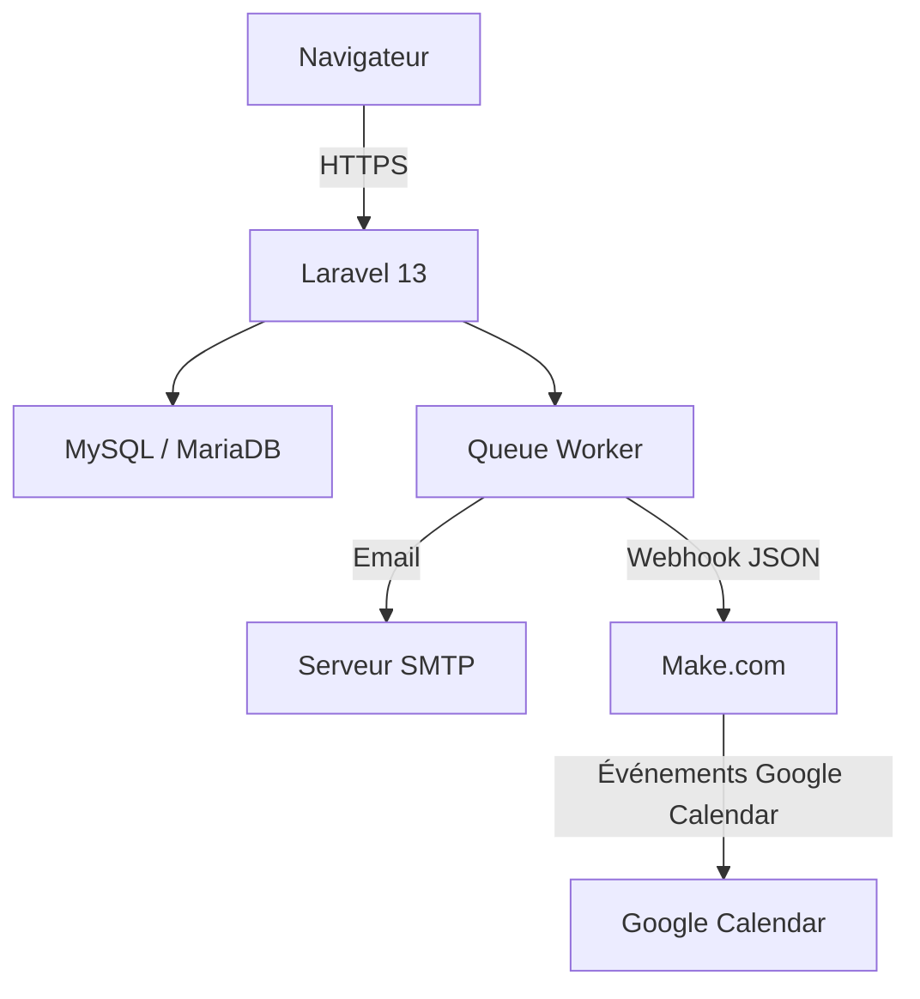
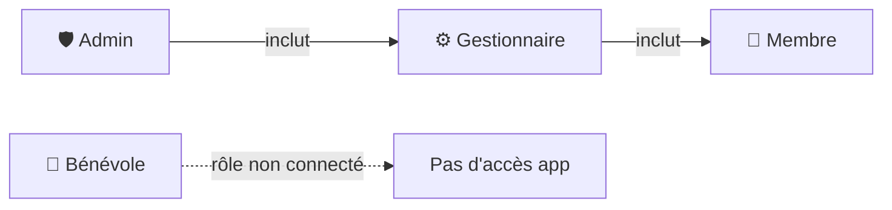
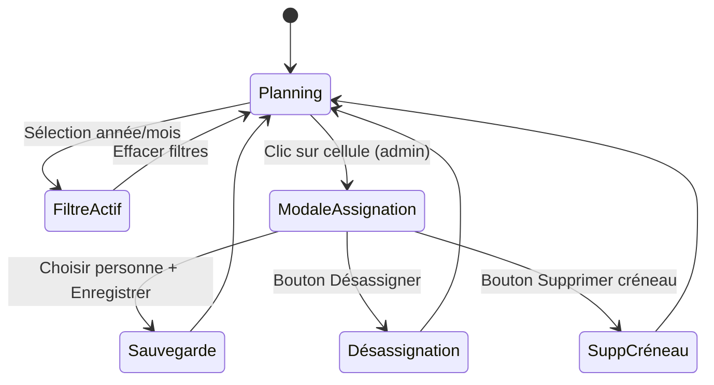
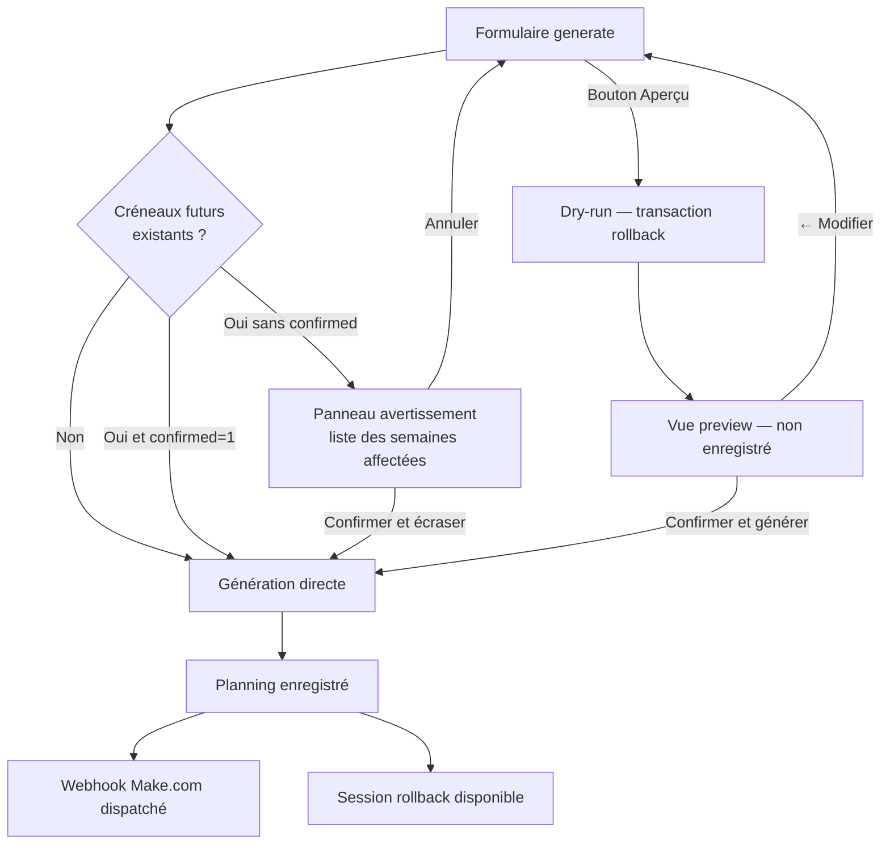
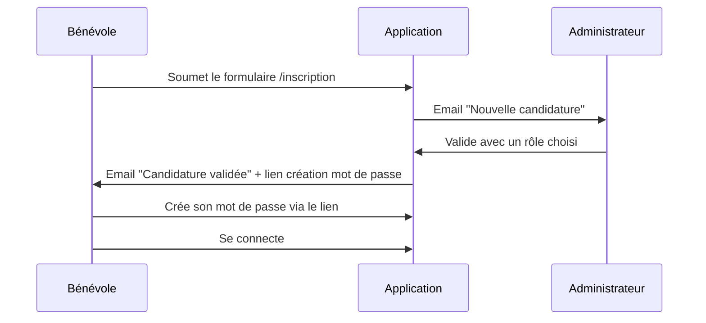
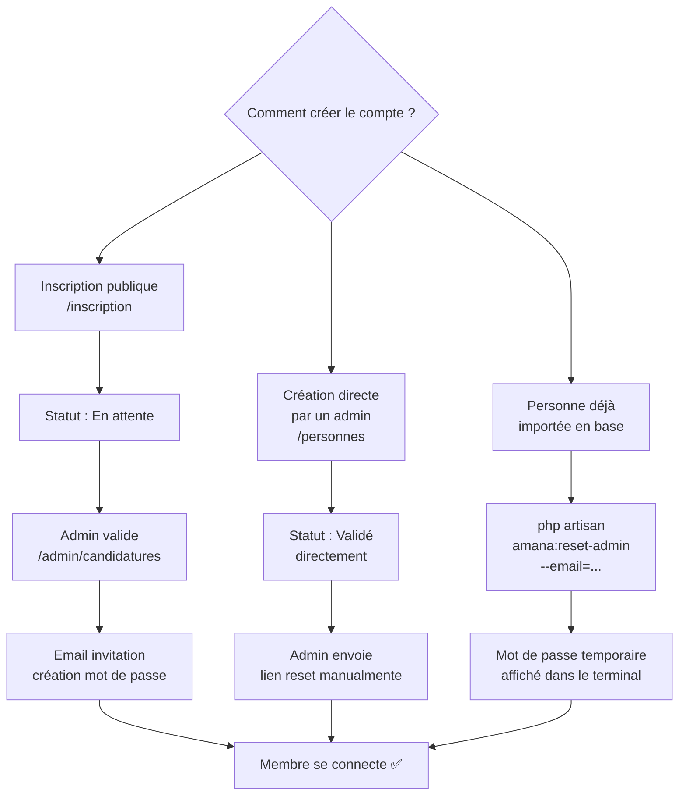
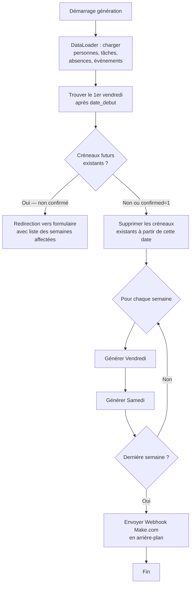
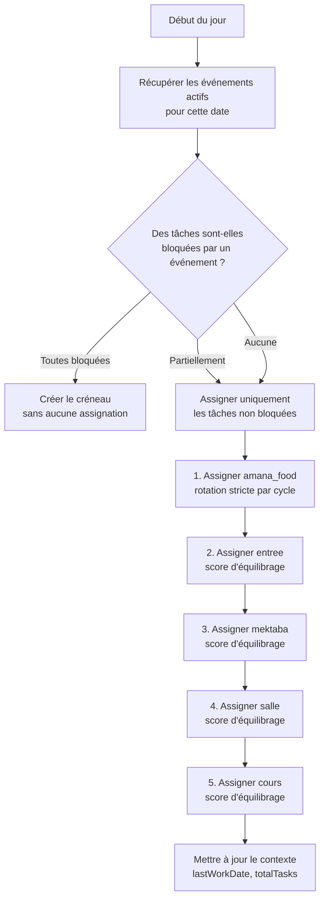
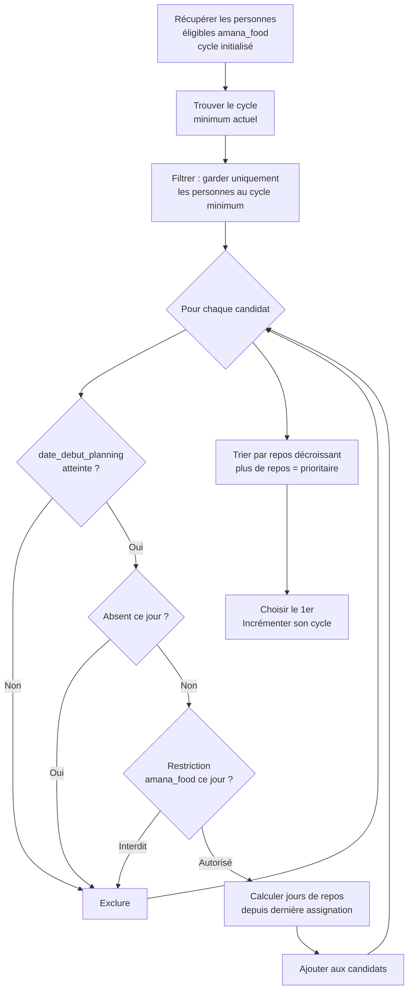

# AMANA Planning — Documentation complète

## Table des matières

1. [Présentation du projet](#présentation-du-projet)
2. [Architecture technique](#architecture-technique)
3. [Rôles et permissions](#rôles-et-permissions)
4. [Vues et fonctionnalités](#vues-et-fonctionnalités)
5. [Gestion des utilisateurs](#gestion-des-utilisateurs)
6. [Algorithme de génération du planning](#algorithme-de-génération-du-planning)
7. [Export PDF](#export-pdf)
8. [Système de notifications](#système-de-notifications)
9. [Intégration Make.com (Webhook)](#intégration-makecom-webhook)

## Documentation complémentaire

| Document                                     | Description                                                                                               |
| -------------------------------------------- | --------------------------------------------------------------------------------------------------------- |
| [docs/installation.md](docs/installation.md) | Prérequis, installation locale (Linux), déploiement IONOS, référence des routes, résolution des problèmes |
| [docs/Schema_bdd.md](docs/Schema_bdd.md)     | Schéma complet de la base de données, diagramme des relations, description de chaque table                |

---

> 📖 **Guides détaillés**
>
> - [**Guide d'installation**](docs/installation.md) — mise en place locale (Ubuntu 24.04) et production, référence complète des routes, résolution des problèmes courants
> - [**Schéma de la base de données**](docs/Schema_bdd.md) — description de chaque table, diagramme ERD, notes sur les fonctionnalités applicatives

---

## Présentation du projet

AMANA Planning est une application web de gestion des permanences hebdomadaires de l'association AMANA. Elle automatise la répartition équitable des tâches entre les membres bénévoles, chaque vendredi et samedi soir.

**Tâches planifiées :**

| Code         | Libellé    | Actif dans le scheduler | Description                                      |
| ------------ | ---------- | :---------------------: | ------------------------------------------------ |
| `entree`     | Entrée     |           ✅            | Accueil des bénéficiaires à l'entrée             |
| `mektaba`    | Mektaba    |           ✅            | Gestion de la bibliothèque / espace documentaire |
| `salle`      | Salle      |           ✅            | Préparation et rangement de la salle             |
| `amana_food` | Amana Food |           ✅            | Distribution alimentaire                         |
| `cours`      | Cours      |           ✅            | Animation du cours du soir                       |

Les tâches suivantes existent dans `ref_taches` mais ne sont **pas incluses dans la rotation du scheduler** (`actif = false`). Elles ne servent qu'à calculer les horaires du payload webhook :

| Code                    | Libellé               |
| ----------------------- | --------------------- |
| `rappel_sandwich`       | Rappel Sandwich       |
| `assistance_amana_food` | Assistance Amana Food |
| `annonce_cours`         | Annonce Cours         |
| `message_general`       | Message Général       |

---

## Architecture technique



**Stack :**

- **Backend :** Laravel 13 (PHP 8.4+)
- **Base de données :** MySQL 8 / MariaDB 10.4+
- **Frontend :** Blade + CSS/JS statiques — pas de framework JS, pas de build npm/Vite. Tout est servi directement depuis `public/css/` et `public/js/`, ce qui simplifie le déploiement sur l'hébergement partagé IONOS.
- **PDF :** barryvdh/laravel-dompdf
- **Queue :** Laravel Queue (driver `database` en prod, `sync` supporté en dev)
- **Automatisation externe :** Make.com via webhook

**Configuration dynamique :**

Tous les paramètres applicatifs (heure du cours, lieu, offsets horaires, noms de calendriers, ouverture des inscriptions) sont stockés dans la table `ref_settings` et gérés via la page **Paramètres** (`/parametres`). Il n'y a **pas** de variable d'environnement pour l'heure du cours — la clé `.env` `HEURE_COURS` présente dans les anciennes versions du projet est obsolète et ignorée.

---

## Rôles et permissions

L'application définit quatre rôles dans l'application `planning`. Chaque personne ne peut avoir qu'un seul rôle à la fois.



### Tableau des accès

| Fonctionnalité                            | Admin | Gestionnaire |    Membre    |
| ----------------------------------------- | :---: | :----------: | :----------: |
| Voir le planning                          |  ✅   |      ✅      |      ✅      |
| Voir mon planning personnel               |  ✅   |      ✅      |      ✅      |
| Voir les statistiques                     |  ✅   |      ✅      |      ✅      |
| Export PDF                                |  ✅   |      ✅      |      ✅      |
| Voir les absences                         |  ✅   |      ✅      |      ✅      |
| Ajouter/supprimer ses absences            |  ✅   |      ✅      |      ✅      |
| Ajouter/supprimer toutes les absences     |  ✅   |      ✅      |      ❌      |
| Voir les disponibilités (grille complète) |  ✅   |      ✅      | ✅ (lecture) |
| Modifier ses disponibilités               |  ✅   |      ✅      |      ✅      |
| Modifier toutes les disponibilités        |  ✅   |      ✅      |      ❌      |
| Générer le planning                       |  ✅   |      ✅      |      ❌      |
| Prévisualiser le planning (dry-run)       |  ✅   |      ✅      |      ❌      |
| Modifier le planning manuellement         |  ✅   |      ✅      |      ❌      |
| Rollback (annuler une génération)         |  ✅   |      ✅      |      ❌      |
| Créer / modifier les événements           |  ✅   |      ✅      |      ❌      |
| Voir les événements                       |  ✅   |      ✅      |      ✅      |
| Paramètres de l'application               |  ✅   | ✅ (partiel) |      ❌      |
| Ouvrir / fermer les inscriptions          |  ✅   |      ❌      |      ❌      |
| Gérer les personnes (CRUD)                |  ✅   |      ❌      |      ❌      |
| Valider / refuser les candidatures        |  ✅   |      ❌      |      ❌      |

> **Note :** Les gestionnaires peuvent accéder à la page Paramètres et modifier les horaires, le lieu, les offsets et les noms de calendriers. Le paramètre **Inscriptions ouvertes/fermées** est réservé aux administrateurs — les gestionnaires voient la section en lecture seule.

---

## Vues et fonctionnalités

### 🏠 Planning (`/planning`)

Vue principale de l'application. Affiche les créneaux regroupés par semaine ISO, du plus récent au plus ancien.

**Fonctionnalités :**

- Par défaut : affichage glissant sur 12 mois (aujourd'hui − 1 an → futur). Un lien « Historique complet » charge tout l'historique à la demande.
- Filtre par année et par mois (filtre par défaut : mois courant + mois précédent, activé automatiquement)
- Bannières informatives par semaine pour les événements (informatifs ou bloquants)
- Clic sur une cellule → modale de réassignation (admin/gestionnaire)
- Bouton « + Créneau » pour ajouter manuellement un jour dans une semaine existante (admin/gestionnaire)
- Suppression d'un créneau ou d'une semaine entière (admin/gestionnaire)
- Toasts de confirmation en temps réel (AJAX)
- Bouton **« Mon planning »** dans le header → accès rapide à la vue personnelle



---

### 🙋 Mon planning (`/mon-planning`)

Vue personnelle filtrée pour le membre connecté. Accessible à tous les rôles depuis la barre latérale et depuis un bouton dans la vue Planning principale.

**Fonctionnalités :**

- Affiche uniquement les créneaux où **la personne connectée est assignée**
- Fenêtre temporelle identique à la vue Planning : un an glissant + futur
- Regroupement par **mois** avec compteur par section
- Chaque créneau est affiché en carte individuelle avec :
  - Bloc date (jour numérique, mois abrégé, nom du jour)
  - Chip de tâche colorée avec icône
  - Numéro de semaine ISO
  - Date complète et nom de l'événement éventuel
  - Badge de statut : **À venir** (futur), **Aujourd'hui**, **Effectué** (passé)
- Bandeau de statistiques rapides : total créneaux, nombre à venir, décompte par tâche
- Vue en **lecture seule** — pas d'édition

---

### ✨ Générer le planning (`/planning/generer`)

Formulaire de génération automatique du planning.

**Paramètres :**

- Date de début (le premier vendredi suivant cette date sera utilisé)
- Nombre de semaines (1 à 52)

**Aperçu dynamique** : le formulaire calcule et affiche en temps réel les dates concernées avant soumission.

**Avertissement de chevauchement** : si des créneaux futurs existent déjà dans la période ciblée, la génération ne se déclenche **pas** immédiatement. À la place, un panneau d'avertissement s'affiche listant toutes les semaines qui seront écrasées, avec pour chacune le label, la plage de dates et le nombre de créneaux concernés. L'admin/gestionnaire doit choisir explicitement entre :

- **Confirmer et écraser** : relance la génération avec `confirmed=1`
- **Annuler** : efface la session et revient au formulaire vierge

**Prévisualisation (dry-run)** : le bouton **« 👁 Aperçu »** soumet les paramètres à une route dédiée (`/planning/generer/apercu`) qui exécute l'algorithme complet **sans rien persister** (transaction rollbackée). Le résultat s'affiche dans une vue preview marquée « Aperçu — non enregistré » avec un filigrane. Depuis cette vue, deux boutons « Confirmer et générer » (haut et bas) soumettent la génération réelle.

**Rollback** : après chaque génération, un panneau de rollback apparaît permettant d'annuler tout ou partie des créneaux générés (par semaine). La session de rollback est conservée jusqu'à fermeture explicite.



---

### 📊 Statistiques (`/planning/stats`)

Tableau de bord de l'équité de la répartition.

**Métriques affichées :**

- Score d'équité global (0–100)
- Écart-type et coefficient de variation
- Déséquilibre vendredi/samedi
- Distribution Amana Food (min/max/moy)
- Jours consécutifs maximum
- Détail par personne : total, vendredis, samedis, chaque tâche, absences

---

### 📄 Export PDF (`/planning/export`)

Génère un fichier PDF du planning sur une plage de dates, au format A4 paysage.

---

### 🏖️ Absences (`/absences`)

Gestion des périodes d'absence. Une absence empêche l'assignation d'une personne pendant la période concernée lors de la génération du planning.

**Règles d'accès :**

- Tout le monde peut voir toutes les absences
- Un membre ne peut ajouter/supprimer que ses propres absences
- Admin/gestionnaire peut gérer les absences de tout le monde

---

### 🔒 Disponibilités (`/restrictions`)

Grille de disponibilité par personne, tâche et jour (Vendredi / Samedi).

- **Case cochée** = la personne peut effectuer la tâche ce jour-là
- **Case décochée** = la personne est indisponible pour cette tâche ce jour-là

**Comportement par défaut :** si aucune ligne n'existe en base pour une combinaison personne/tâche/jour, la personne est considérée **disponible**. Une ligne n'est créée que pour exprimer une contrainte.

**Cas d'usage typique :** pour la tâche `cours`, cocher uniquement la personne désignée pour animer le cours, et décocher tous les autres.

Admin/gestionnaire voient la grille complète modifiable. Les membres voient la grille en lecture seule et disposent d'un formulaire pour modifier uniquement leurs propres disponibilités.

---

### 🎉 Événements (`/evenements`)

Les événements organisationnels (vacances, Ramadan, conférences…) peuvent bloquer certaines tâches lors de la génération.

**Deux types :**

| Type                                           | Comportement                                                                              |
| ---------------------------------------------- | ----------------------------------------------------------------------------------------- |
| **Informatif** (aucune tâche cochée)           | Affiche une bannière dans le planning, n'affecte pas les assignations                     |
| **Bloquant** (une ou plusieurs tâches cochées) | Les tâches sélectionnées ne sont pas assignées pour les créneaux couverts par l'événement |

Les tâches bloquées sont gérées via la table pivot `ref_evenements_taches`. Les créneaux liés à un événement actif sont enregistrés dans `plan_creneaux_evenements`.

---

### ⚙️ Paramètres (`/parametres`)

Configuration de l'application (admin/gestionnaire, avec restrictions selon le rôle).

**Sections :**

| Section               | Modifiable par       | Description                                                       |
| --------------------- | -------------------- | ----------------------------------------------------------------- |
| Inscriptions ouvertes | Admin uniquement     | Active ou désactive le formulaire public `/inscription`           |
| Heure du cours & Lieu | Admin + Gestionnaire | Heure de référence pour les horaires webhook ; adresse physique   |
| Calendriers Google    | Admin + Gestionnaire | Nom exact du calendrier Google Calendar cible par tâche/événement |
| Décalages des tâches  | Admin + Gestionnaire | Offsets en minutes (positif = après le cours, négatif = avant)    |

> Tous ces paramètres sont stockés dans `ref_settings` et lus dynamiquement — il n'y a pas de valeur en `.env` pour ces réglages.

---

### 👥 Personnes (`/personnes`)

CRUD complet des membres et bénévoles (admin uniquement).

**Statuts possibles :**

| Statut       | Signification                           |
| ------------ | --------------------------------------- |
| `En attente` | Candidature soumise, pas encore validée |
| `Validé`     | Membre actif, inclus dans le planning   |
| `Suspendu`   | Temporairement désactivé                |
| `Archivé`    | Inactif, exclu du planning              |

---

### 📥 Candidatures (`/admin/candidatures`)

Tableau de bord des inscriptions en attente de validation.

**Flux de validation :**



**Actions disponibles :**

- **Valider** : choisir le rôle (admin / gestionnaire / membre), passe le statut à `Validé`, envoie l'email d'invitation
- **Refuser** : passe le statut à `Archivé`
- **Renvoyer l'invitation** : renvoie l'email avec un nouveau lien de création de mot de passe

> **Note :** si la personne possède déjà un mot de passe (compte existant sur une autre app AMANA), l'email envoyé est différent — il lui indique de se connecter directement avec son mot de passe habituel, sans lien de reset.

---

## Gestion des utilisateurs

### Création d'un compte (3 chemins possibles)



> Le formulaire public `/inscription` peut être désactivé par un administrateur via **Paramètres → Inscriptions ouvertes**. Lorsqu'il est fermé, la page affiche une redirection vers la connexion.

### Commande de secours

```bash
# Réinitialiser/créer un compte admin via SSH
php artisan amana:reset-admin

# Avec un email spécifique
php artisan amana:reset-admin --email=mon@email.fr

# Avec un mot de passe prédéfini
php artisan amana:reset-admin --email=mon@email.fr --password=NouveauMotDePasse!
```

---

## Algorithme de génération du planning

### Vue d'ensemble



### Mode dry-run (prévisualisation)

Lorsque `SchedulerMain::generateSchedule` est appelé avec `dryRun: true` (depuis `PlanningController::preview`) :

- Les créneaux existants **ne sont pas supprimés**
- L'algorithme s'exécute normalement mais dans une **transaction DB**
- La transaction est **rollbackée** à la fin — aucune donnée n'est persistée
- Le retour contient le tableau des propositions d'assignation par jour, affiché dans `planning/preview.blade.php`
- Aucun webhook n'est dispatché

```mermaid
flowchart LR
    A[Bouton Aperçu] --> B[POST /planning/generer/apercu]
    B --> C[SchedulerMain::generateSchedule\ndryRun=true]
    C --> D[DB::beginTransaction]
    D --> E[Calcul complet des assignations]
    E --> F[DB::rollBack]
    F --> G[Vue preview — non enregistré]
    G -->|Confirmer| H[POST /planning/generer\nconfirmed=1]
    H --> I[Génération réelle]
```



### Pour chaque jour (vendredi ou samedi)



### Algorithme Amana Food (rotation stricte)

La tâche `amana_food` utilise un cycle global indépendant du jour de la semaine. L'objectif est que chaque personne éligible passe le même nombre de fois.



**Exemple :** si Alice est à 3 cycles et Bob à 4, c'est au tour d'Alice. Si plusieurs personnes sont au même cycle minimum, c'est celle qui n'a pas travaillé depuis le plus longtemps qui passe.

### Algorithme autres tâches (score d'équilibrage)

Pour `entree`, `mektaba`, `salle` et `cours`, un score est calculé pour chaque candidat. **Le score le plus bas est prioritaire.**

```txt
Score = (total_assignations × 10) - (jours_de_repos × 1) + (nb_fois_cette_tâche × multiplicateur)
```

**Multiplicateur adaptatif** selon le nombre d'options disponibles de la personne :

| Options disponibles | Multiplicateur | Effet                                |
| ------------------- | -------------- | ------------------------------------ |
| ≥ 8                 | × 80           | Forte pénalité si répétition         |
| ≥ 6                 | × 60           | Pénalité élevée                      |
| ≥ 4                 | × 40           | Pénalité modérée                     |
| < 4                 | × 20           | Pénalité faible (peu d'alternatives) |

> **Pourquoi ce multiplicateur ?** Une personne avec peu d'options (ex : autorisée sur seulement 2 tâches) sera inévitablement répétée plus souvent sur ces tâches. Le multiplicateur réduit la pénalité pour ne pas la désavantager par rapport à des membres plus polyvalents.

**Règle anti-doublon :** une personne déjà assignée à une tâche dans le même créneau ne peut pas être assignée à une autre tâche du même jour.

### Initialisation du contexte depuis l'historique

Avant de générer, l'algorithme charge **tout l'historique** de la base de données pour initialiser les compteurs :

- `lastWorkDate` : dernière date de travail par personne
- `totalTasks` : nombre total d'assignations par personne
- `taskHistory` : nombre de fois qu'une personne a fait chaque tâche
- `amanaFoodCycles` : cycle actuel de chaque personne éligible à amana_food

Cela garantit une continuité parfaite d'une génération à l'autre.

---

## Export PDF

Le PDF est généré à la demande via le formulaire `/planning/export`. Il utilise DomPDF avec :

- Format A4 paysage
- En-tête avec logo AMANA et plage de dates
- Tableau par semaine avec toutes les tâches
- Indication des événements et créneaux bloqués
- Police DejaVu Sans (support caractères spéciaux)

---

## Système de notifications

Toutes les notifications sont envoyées de manière **asynchrone** (via la queue) pour ne pas bloquer la réponse HTTP.

| Déclencheur                           | Destinataire    | Email                                                    |
| ------------------------------------- | --------------- | -------------------------------------------------------- |
| Nouvelle inscription                  | Tous les admins | « Nouvelle candidature » avec fiche complète du candidat |
| Candidature validée (nouveau membre)  | Le candidat     | « Bienvenue » + lien création mot de passe               |
| Candidature validée (compte existant) | Le candidat     | « Votre accès est activé » + lien de connexion directe   |

---

## Intégration Make.com (Webhook)

Après chaque génération de planning (ou après toute modification manuelle d'une assignation), l'application envoie un payload JSON à Make.com via un job asynchrone (`EnvoyerWebhookMake`). Make.com peut alors créer automatiquement des événements Google Calendar pour les rappels et notifications de l'équipe.

> Le webhook n'est **pas** dispatché lors d'une prévisualisation dry-run.

**Variable `.env` concernée :**

```dotenv
MAKE_WEBHOOK_URL=https://hook.make.com/votre-identifiant
```

> L'heure du cours n'est **plus** lue depuis `.env`. Elle est stockée dans `ref_settings` (clé `heure_cours`) et modifiable via la page Paramètres. La variable `HEURE_COURS` présente dans certains anciens fichiers `.env.example` est obsolète.

**Déclencheurs du webhook :**

| Action                                  | Méthode appelée                            | Contenu                         |
| --------------------------------------- | ------------------------------------------ | ------------------------------- |
| Génération d'un planning                | `WebhookPayloadBuilder::build()`           | Tous les créneaux de la période |
| Modification manuelle d'une assignation | `WebhookPayloadBuilder::buildForCreneau()` | Le créneau modifié uniquement   |

**Structure complète du payload :**

```json
{
    "genere_le": "2025-06-06T20:00:00+02:00",
    "heure_cours": "20:00",
    "lieu": "319 Rte de Vannes, 44800 Saint-Herblain, France",
    "creneaux": [
        {
            "date": "2025-06-06",
            "jour": "Vendredi",
            "semaine": 23,
            "evenements": null,
            "taches": {
                "entree": {
                    "nom_complet": "Prénom Nom",
                    "email": "personne@exemple.fr",
                    "heure_debut": "19:30",
                    "heure_fin": "20:30",
                    "calendar_name": "AMANA - Planning",
                    "description": ""
                },
                "mektaba": {
                    "nom_complet": "Prénom Nom",
                    "email": "personne@exemple.fr",
                    "heure_debut": "19:40",
                    "heure_fin": "21:40",
                    "calendar_name": "AMANA - Planning",
                    "description": ""
                },
                "salle": {
                    "nom_complet": "Prénom Nom",
                    "email": "personne@exemple.fr",
                    "heure_debut": "20:00",
                    "heure_fin": "21:30",
                    "calendar_name": "AMANA - Planning",
                    "description": ""
                },
                "amana_food": {
                    "nom_complet": "Prénom Nom",
                    "email": "personne@exemple.fr",
                    "heure_debut": "20:30",
                    "heure_fin": "21:30",
                    "calendar_name": "AMANA - Planning",
                    "description": ""
                },
                "cours": {
                    "nom_complet": "Prénom Nom",
                    "email": "personne@exemple.fr",
                    "heure_debut": "20:00",
                    "heure_fin": "21:00",
                    "calendar_name": "AMANA - Planning",
                    "description": "Animation du cours"
                }
            },
            "evenements_speciaux": {
                "rappel_sandwich": {
                    "nom_complet": "Prénom Nom",
                    "email": "personne@exemple.fr",
                    "heure_debut": "08:00",
                    "heure_fin": "08:15",
                    "calendar_name": "AMANA - Planning",
                    "description": ""
                },
                "assistance_amana_food": {
                    "nom_complet": "Prénom Nom",
                    "email": "personne@exemple.fr",
                    "heure_debut": "20:30",
                    "heure_fin": "21:30",
                    "calendar_name": "AMANA - Planning",
                    "description": ""
                }
            },
            "evenements_sociaux": {
                "annonce_cours": {
                    "nom_complet": null,
                    "email": null,
                    "heure_debut": "14:00",
                    "heure_fin": "14:15",
                    "calendar_name": "AMANA - Communications",
                    "description": ""
                },
                "message_general": {
                    "nom_complet": null,
                    "email": null,
                    "heure_debut": "19:30",
                    "heure_fin": "20:00",
                    "calendar_name": "AMANA - Communications",
                    "description": ""
                }
            }
        }
    ]
}
```

**Notes importantes sur le payload :**

- Les horaires (`heure_debut`, `heure_fin`) sont calculés en ajoutant les offsets configurés dans **Paramètres** à l'heure du cours stockée en base.
- `rappel_sandwich` a un horaire fixe (08:00–08:15) indépendant des offsets.
- Si une tâche est **bloquée par un événement** sur ce créneau, elle est **absente** du payload (ni dans `taches`, ni dans `evenements_speciaux`).
- `rappel_sandwich` utilise la personne assignée à `amana_food` ; `assistance_amana_food` utilise la personne assignée à `entree`.
- `evenements_sociaux` (`annonce_cours`, `message_general`) n'ont pas de `nom_complet` ni d'`email` — ce sont des événements automatisés sans assignation personnelle.
- `calendar_name` correspond au nom exact du calendrier Google Calendar cible, configuré dans **Paramètres → Calendriers**. S'il est vide, Make.com utilise son calendrier par défaut.
- Le champ `evenements` au niveau du créneau est une chaîne avec les noms des événements organisationnels actifs ce jour-là (ex : `"Ramadan"`) ou `null`.
