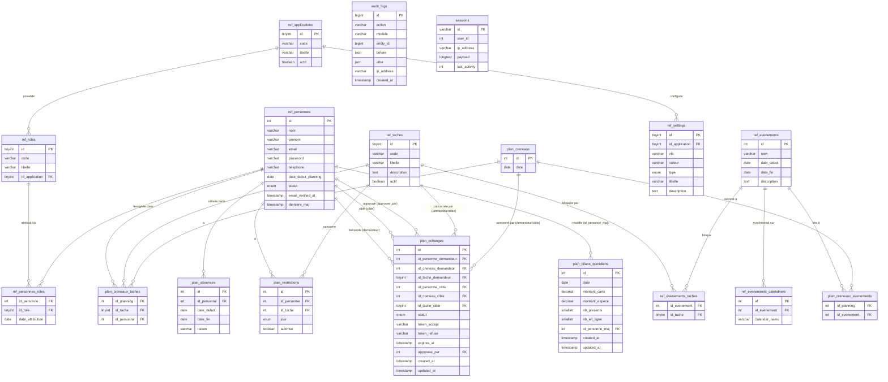

# Base de données — AMANA Planning

## Table des matières

1. [Schéma général](#schéma-général)
2. [Diagramme des relations](#diagramme-des-relations)
3. [Description des tables](#description-des-tables)

---

## Schéma général

La base de données est organisée en trois groupes fonctionnels :

| Groupe          | Préfixe          | Rôle                                                                                |
| --------------- | ---------------- | ------------------------------------------------------------------------------------ |
| **Référentiel** | `ref_`           | Données de configuration stables (personnes, rôles, tâches, paramètres, événements) |
| **Planning**    | `plan_`          | Données opérationnelles (créneaux, assignations, absences, restrictions, échanges, bilans) |
| **Système**     | _(sans préfixe)_ | Tables techniques Laravel (sessions, jobs, cache, audit)                            |

> **Aucune migration n'a été ajoutée** pour les fonctionnalités « Mon planning », « Avertissement de chevauchement » et « Dry-run preview ». Ces trois fonctionnalités sont purement applicatives et n'ajoutent aucune table ni colonne.
>
> **Migrations ajoutées** pour les fonctionnalités décrites ci-dessous :
>
> - `plan_echanges` — échanges de créneaux entre membres
> - `plan_bilans_quotidiens` — bilan quotidien (Amana food + Présences), un enregistrement partagé par date
> - `ref_evenements_calendriers` — synchronisation Google Calendar par événement, **plusieurs calendriers par événement** possible (remplace l'ancienne colonne `ref_evenements.calendar_name`, supprimée)
> - Tâche `annulation_cours` (dans `ref_taches`, `actif = false`) + ses paramètres `calendar_annulation_cours` / `offset_annulation_cours_debut` / `offset_annulation_cours_fin` (dans `ref_settings`) — support du bouton **« 🚫 Annulation cours »** du planning

---

## Diagramme des relations



---

## Description des tables

### `ref_applications`

Référentiel des applications du système AMANA partageant la même base de données. Chaque application possède ses propres rôles et paramètres.

| Colonne   | Type               | Description                                            |
| --------- | ------------------ | -------------------------------------------------------- |
| `id`      | TINYINT PK         | Identifiant auto-incrémenté                            |
| `code`    | VARCHAR(50) UNIQUE | Identifiant technique (`planning`, `livraisons`…)      |
| `libelle` | VARCHAR(100)       | Nom lisible                                            |
| `actif`   | BOOLEAN            | Permet de désactiver une application sans la supprimer |

---

### `ref_roles`

Rôles disponibles par application. Un rôle est toujours rattaché à une application spécifique.

| Colonne          | Type         | Description                                                    |
| ---------------- | ------------ | ---------------------------------------------------------------- |
| `id`             | TINYINT PK   | Identifiant                                                    |
| `code`           | VARCHAR(50)  | Code technique (`admin`, `gestionnaire`, `membre`, `benevole`) |
| `libelle`        | VARCHAR(100) | Libellé affiché                                                |
| `id_application` | TINYINT FK   | Application propriétaire du rôle                               |

> Contrainte unique : `(code, id_application)`.
> **`gestionnaire`** inclut de facto les mêmes accès que `admin` sur tout ce qui touche à la modification du planning — le middleware `role:gestionnaire` autorise les deux rôles (voir README, section Rôles et permissions).

---

### `ref_personnes`

Table centrale — remplace la table `users` standard de Laravel. Contient tous les membres, bénévoles et candidats.

| Colonne               | Type                 | Description                                                                                  |
| --------------------- | -------------------- | ------------------------------------------------------------------------------------------------ |
| `id`                  | INT PK               | Identifiant                                                                                  |
| `nom`                 | VARCHAR(100)         | Nom de famille                                                                               |
| `prenom`              | VARCHAR(100)         | Prénom                                                                                       |
| `email`               | VARCHAR(255) UNIQUE  | Email = identifiant de connexion                                                             |
| `password`            | VARCHAR NULLABLE     | Hash bcrypt — NULL tant que le membre n'a pas créé son mot de passe via le lien d'invitation |
| `remember_token`      | VARCHAR              | Token "se souvenir de moi" (standard Laravel)                                                |
| `email_verified_at`   | TIMESTAMP NULLABLE   | Date de vérification email — renseigné à la création du mot de passe                         |
| `telephone`           | VARCHAR(20) NULLABLE | Numéro de téléphone                                                                          |
| `date_debut_planning` | DATE NULLABLE        | Date d'entrée dans la rotation — les créneaux antérieurs à cette date ne sont pas assignés   |
| `statut`              | ENUM                 | `En attente` / `Validé` / `Suspendu` / `Archivé`                                             |
| `derniere_maj`        | TIMESTAMP            | Mis à jour automatiquement à chaque modification                                             |

> **Seules les personnes avec `statut = Validé` sont incluses dans la génération du planning.**
> `date_debut_planning` est utilisée par l'algorithme pour ne pas assigner une nouvelle recrue avant son arrivée effective.
>
> **Échanges de créneaux :** une personne peut apparaître dans `plan_echanges` à trois titres possibles — `id_personne_demandeur` (elle initie l'échange), `id_personne_cible` (on lui propose un échange) ou `approuve_par` (elle a approuvé l'échange en tant qu'admin/gestionnaire).

---

### `ref_personnes_roles`

Table pivot N-N entre personnes et rôles. Une personne ne peut avoir qu'un seul rôle par application.

| Colonne            | Type       | Description                    |
| ------------------ | ---------- | --------------------------------- |
| `id_personne`      | INT FK     | Référence vers `ref_personnes` |
| `id_role`          | TINYINT FK | Référence vers `ref_roles`     |
| `date_attribution` | DATE       | Date d'attribution du rôle     |

> Clé primaire composite : `(id_personne, id_role)`.

---

### `ref_taches`

Référentiel des tâches planifiables.

| Colonne       | Type               | Description                                                           |
| ------------- | ------------------ | --------------------------------------------------------------------- |
| `id`          | TINYINT PK         | Identifiant                                                           |
| `code`        | VARCHAR(50) UNIQUE | Code technique (`entree`, `mektaba`, `salle`, `amana_food`, `cours`…) |
| `libelle`     | VARCHAR(100)       | Libellé affiché                                                       |
| `description` | TEXT NULLABLE      | Description envoyée dans le payload webhook                           |
| `actif`       | BOOLEAN            | `true` = incluse dans la rotation du scheduler                        |

**Tâches actives (rotation) :** `entree`, `mektaba`, `salle`, `amana_food`, `cours`

**Tâches inactives (webhook uniquement, pas de rotation) :** `rappel_sandwich`, `assistance_amana_food`, `annonce_cours`, `message_bot`, `annulation_cours`

> `annulation_cours` sert uniquement à retrouver le `libelle` de l'entrée `evenements_sociaux` envoyée par le bouton **« Annulation cours »** du planning (voir README, section Intégration Make.com) — elle n'est jamais assignée à une personne et n'apparaît dans aucun `plan_creneaux_taches`.
>
> **Échanges de créneaux :** `id_tache_demandeur` et `id_tache_cible` dans `plan_echanges` référencent cette table. Un échange ne peut concerner que des tâches actives déjà assignées dans le planning — le service `EchangeService` restreint par défaut les slots échangeables à la **même tâche** (même `code`) que le slot d'origine.

---

### `ref_evenements`

Événements organisationnels (vacances, Ramadan, jours fériés, cours annulés…). Peut optionnellement être synchronisé avec un ou plusieurs calendriers Google Calendar via Make.com (voir `ref_evenements_calendriers` ci-dessous).

| Colonne       | Type          | Description                  |
| ------------- | ------------- | ----------------------------- |
| `id`          | INT PK        | Identifiant                  |
| `nom`         | VARCHAR(150)  | Nom de l'événement            |
| `date_debut`  | DATE          | Début de la période          |
| `date_fin`    | DATE          | Fin de la période (incluse)  |
| `description` | TEXT NULLABLE | Notes complémentaires        |

> Index sur `(date_debut, date_fin)` pour les recherches de chevauchement.
>
> **Synchronisation retroactive du planning déjà généré :** à chaque création ou modification d'un événement, `EvenementsController::syncCreneauLinks()` relie l'événement (`plan_creneaux_evenements`) à tous les créneaux **futurs** existants dont la date tombe dans sa plage — que l'événement soit bloquant ou purement informatif. Si l'événement est **bloquant**, toute tâche déjà assignée sur ces créneaux et nouvellement couverte est réellement **désassignée** (`id_personne = NULL`, webhook DELETE envoyé, `audit_logs` renseigné) — pas seulement masquée visuellement — car cela affecte l'équité de répartition et les statistiques. **Les créneaux déjà passés (date < aujourd'hui) ne sont jamais modifiés**, même liés informativement ; l'utilisateur reçoit un avertissement explicite s'il tente de créer/modifier un événement chevauchant des dates passées.
>
> **Bouton « Annulation cours » du planning :** annuler la date d'un cours crée automatiquement un événement `"Cours annulé — {date}"` bloquant **toutes les tâches actives**, visible dans la liste des Événements comme n'importe quel autre événement.

---

### `ref_evenements_taches`

Table pivot N-N entre événements et tâches bloquées. Si un événement n'a aucune entrée ici, il est purement informatif et n'affecte pas la génération.

| Colonne        | Type       | Description                     |
| -------------- | ---------- | ---------------------------------- |
| `id_evenement` | INT FK     | Référence vers `ref_evenements` |
| `id_tache`     | TINYINT FK | Référence vers `ref_taches`     |

> Clé primaire composite : `(id_evenement, id_tache)`.

---

### `ref_evenements_calendriers`

Calendriers Google Calendar sur lesquels un événement organisationnel est synchronisé. **Un événement peut être synchronisé sur plusieurs calendriers à la fois** (relation 1-N, remplace l'ancienne colonne unique `ref_evenements.calendar_name`).

| Colonne         | Type          | Description                                     |
| --------------- | ------------- | ------------------------------------------------ |
| `id`            | INT PK        | Identifiant                                     |
| `id_evenement`  | INT FK        | Référence vers `ref_evenements` (`onDelete: cascade`) |
| `calendar_name` | VARCHAR(200)  | Nom exact du calendrier Google Calendar cible   |

> Contrainte unique : `(id_evenement, calendar_name)` — un même calendrier ne peut pas être ajouté deux fois au même événement.
>
> **Aucune ligne pour un événement donné** = pas de synchronisation calendrier (équivalent de l'ancien `calendar_name = NULL`). Si au moins une ligne existe, `EvenementsController` dispatche un job `EnvoyerWebhookMake` vers Make.com à chaque `create`, `update` ou `delete` de l'événement, via `WebhookEvenementPayloadBuilder` — le payload envoie alors `calendar_names` (tableau JSON de tous les noms liés), pas une chaîne unique. Voir README, section Intégration Make.com.
>
> Cette table est **indépendante** des clés `calendar_*` de `ref_settings`, qui configurent les calendriers des **tâches du planning** (entree, mektaba, etc.), pas des événements organisationnels.

---

### `ref_settings`

Paramètres de configuration par application — paires clé/valeur typées.

| Colonne          | Type                | Description                                                                  |
| ---------------- | ------------------- | -------------------------------------------------------------------------------- |
| `id`             | TINYINT PK          | Identifiant                                                                  |
| `id_application` | TINYINT FK NULLABLE | Application concernée (NULL = global)                                        |
| `cle`            | VARCHAR(100)        | Clé du paramètre (`heure_cours`, `offset_entree_debut`…)                     |
| `valeur`         | VARCHAR(500)        | Valeur stockée sous forme de chaîne                                          |
| `type`           | ENUM                | `string` / `integer` / `time` / `boolean` — utilisé pour le cast automatique |
| `libelle`        | VARCHAR(200)        | Libellé affiché dans l'UI                                                    |
| `description`    | TEXT NULLABLE       | Explication détaillée                                                        |

> Contrainte unique : `(id_application, cle)`.
> Le modèle `Setting` inclut un cache statique par requête HTTP pour éviter les requêtes N+1.
>
> **Clés `calendar_*` / `offset_*_debut` / `offset_*_fin`** existent pour chaque code de tâche (actif **et** inactif — voir `ref_taches`), y compris désormais `calendar_annulation_cours`, `offset_annulation_cours_debut` et `offset_annulation_cours_fin`, éditables comme les autres depuis `/parametres`.

---

### `plan_creneaux`

Un créneau = une date de permanence (vendredi ou samedi). Une seule ligne par date.

| Colonne | Type        | Description           |
| ------- | ----------- | ---------------------- |
| `id`    | INT PK      | Identifiant           |
| `date`  | DATE UNIQUE | Date de la permanence |

> L'accesseur `jour` retourne `"Vendredi"` ou `"Samedi"`. L'accesseur `semaine` retourne le numéro de semaine ISO.
>
> **Vue Mon planning :** `MonPlanningController` interroge cette table via un `JOIN` sur `plan_creneaux_taches` filtré par `id_personne = auth()->id()`, sans aucune colonne supplémentaire.
>
> **Échanges de créneaux :** `id_creneau_demandeur` et `id_creneau_cible` dans `plan_echanges` référencent cette table. La suppression d'un créneau (`onDelete('cascade')`) supprime également tout échange en cours qui le concerne.
>
> **Annulation d'un cours :** le bouton **« 🚫 Annulation cours »** ne supprime **pas** la ligne `plan_creneaux` correspondante — il désassigne toutes ses tâches (`plan_creneaux_taches.id_personne = NULL`) et la relie à un nouvel événement bloquant (voir `ref_evenements`). La ligne reste donc visible dans le planning, marquée bloquée.

---

### `plan_creneaux_taches`

Cœur du planning : lie un créneau à une tâche et à la personne assignée.

| Colonne       | Type            | Description                                   |
| ------------- | --------------- | ------------------------------------------------ |
| `id_planning` | INT FK          | Référence vers `plan_creneaux`                |
| `id_tache`    | TINYINT FK      | Référence vers `ref_taches`                   |
| `id_personne` | INT FK NULLABLE | Personne assignée — NULL = tâche non assignée |

> Clé primaire composite : `(id_planning, id_tache)`.
> La suppression d'un créneau déclenche la suppression en cascade de toutes ses assignations.
>
> **En mode dry-run**, des lignes sont temporairement insérées dans cette table le temps du calcul, puis supprimées par le rollback de transaction. Aucun effet visible en dehors de la transaction.
>
> **Échanges de créneaux :** un échange accepté modifie directement deux lignes de cette table — la colonne `id_personne` du slot du demandeur prend l'ID de la personne cible, et vice-versa. Cette opération est exécutée par `EchangeService::executerEchange()` dans une transaction DB. Aucune colonne supplémentaire n'a été ajoutée à cette table ; l'historique de l'échange vit entièrement dans `plan_echanges`.
>
> **Événement créé/modifié après génération :** si un événement bloquant est créé (ou étendu) pour une date déjà générée, les lignes correspondantes de cette table sont réellement désassignées (`id_personne = NULL`) — voir `ref_evenements` ci-dessus. **Jamais** pour un créneau dont `plan_creneaux.date` est déjà passée.

---

### `plan_creneaux_evenements`

Table pivot N-N entre créneaux et événements qui les concernent. Peuplée à la génération (`SchedulerMain`) **et** de façon rétroactive à chaque création/modification d'un événement pour les créneaux futurs déjà générés (voir `ref_evenements`).

| Colonne        | Type   | Description                     |
| -------------- | ------ | ---------------------------------- |
| `id_planning`  | INT FK | Référence vers `plan_creneaux`  |
| `id_evenement` | INT FK | Référence vers `ref_evenements` |

> Clé primaire composite : `(id_planning, id_evenement)`.

---

### `plan_absences`

Périodes d'absence des membres. Une personne absente n'est pas assignée lors de la génération pour les créneaux couverts.

| Colonne       | Type                  | Description                |
| ------------- | ---------------------- | ---------------------------- |
| `id`          | INT PK                | Identifiant                |
| `id_personne` | INT FK                | Personne concernée         |
| `date_debut`  | DATE                  | Début de l'absence         |
| `date_fin`    | DATE                  | Fin de l'absence (incluse) |
| `raison`      | VARCHAR(255) NULLABLE | Motif libre                |

> Index sur `id_personne` et `(date_debut, date_fin)`.

---

### `plan_restrictions`

Disponibilités par personne, tâche et jour de la semaine.

| Colonne       | Type       | Description                                                 |
| ------------- | ---------- | --------------------------------------------------------------- |
| `id`          | INT PK     | Identifiant                                                 |
| `id_personne` | INT FK     | Personne concernée                                          |
| `id_tache`    | TINYINT FK | Tâche concernée                                             |
| `jour`        | ENUM       | `Lundi` à `Dimanche`                                        |
| `autorise`    | BOOLEAN    | `true` = peut faire la tâche ce jour / `false` = interdit |

> Contrainte unique : `(id_personne, id_tache, jour)`.
> **Comportement par défaut :** si aucune ligne n'existe pour une combinaison, la personne est considérée **disponible**. Une ligne n'est créée que pour exprimer une contrainte explicite.

---

### `plan_echanges`

Demandes d'échange de créneau entre deux membres. Un échange permet à un membre (le demandeur, "A") d'échanger un de ses créneaux futurs contre celui d'un autre membre (la cible, "B") assigné à la même tâche.

| Colonne                   | Type               | Description                                                                                       |
| -------------------------- | ------------------ | ------------------------------------------------------------------------------------------------- |
| `id`                      | INT PK             | Identifiant                                                                                       |
| `id_personne_demandeur`   | INT FK             | Personne qui demande l'échange (A)                                                                |
| `id_creneau_demandeur`    | INT FK             | `id_planning` du créneau de A                                                                     |
| `id_tache_demandeur`      | TINYINT FK         | `id_tache` du slot de A                                                                           |
| `id_personne_cible`       | INT FK             | Personne avec qui échanger (B)                                                                    |
| `id_creneau_cible`        | INT FK             | `id_planning` du créneau de B                                                                     |
| `id_tache_cible`          | TINYINT FK         | `id_tache` du slot de B                                                                           |
| `statut`                  | ENUM               | `en_attente` / `accepte` / `refuse` / `expire` / `annule`                                         |
| `token_accept`            | VARCHAR(64) UNIQUE | Token à usage unique pour le lien email « Accepter »                                              |
| `token_refuse`            | VARCHAR(64) UNIQUE | Token à usage unique pour le lien email « Refuser »                                               |
| `expires_at`              | TIMESTAMP          | Date d'expiration = date du créneau de A (fin de journée) — passé ce délai, la demande expire     |
| `approuve_par`            | INT FK NULLABLE    | ID de l'admin/gestionnaire si l'échange a été approuvé manuellement (override de la réponse de B) |
| `created_at`/`updated_at` | TIMESTAMP          | Horodatage standard                                                                               |

> Index sur `id_personne_demandeur`, `id_personne_cible`, `statut`, `expires_at`.
>
> **Cycle de vie du statut :**
>
> ```txt
> en_attente ──► accepte   (B accepte via token, OU admin/gestionnaire approuve)
>            ──► refuse    (B refuse via token, OU admin/gestionnaire refuse)
>            ──► expire    (date du créneau de A dépassée sans réponse — commande planifiée)
>            ──► annule    (le demandeur A annule lui-même sa demande)
> ```
>
> **Exécution de l'échange (statut → `accepte`) :** dans une transaction DB, `EchangeService::executerEchange()` met à jour deux lignes de `plan_creneaux_taches` — le slot de A reçoit `id_personne = id_personne_cible` et le slot de B reçoit `id_personne = id_personne_demandeur`. Les deux parties reçoivent un email de confirmation. Si l'échange est approuvé par un admin/gestionnaire avant la réponse de B, cette approbation **prend le pas** sur l'attente.
>
> **Tokens à usage unique :** une fois l'échange dans un statut terminal (`accepte`, `refuse`, `expire`, `annule`), les tokens ne permettent plus aucune action — `EchangeController::accepter()`/`refuser()` vérifient `isEnAttente()` avant d'exécuter quoi que ce soit. Pour échanger à nouveau (y compris un swap retour), une **nouvelle demande** doit être créée — aucun token n'est jamais réutilisé.
>
> **Expiration automatique :** la commande planifiée `php artisan amana:expire-echanges` (enregistrée dans `routes/console.php`, exécutée quotidiennement) marque `expire` tout échange `en_attente` dont `expires_at` est dépassé, puis notifie le demandeur.
>
> **Restriction de cohérence :** `EchangeService::slotsEchangeables()` ne propose que des slots futurs, assignés, sur la **même tâche** (`ref_taches.code` identique), appartenant à une personne différente du demandeur, et non déjà impliqués dans un autre échange `en_attente`.
>
> **Hors scope (non couvert par cette table) :** le cas où la personne cible B n'a **aucun créneau futur généré** sur la même tâche. Il n'y a alors aucun slot à échanger — une éventuelle fonctionnalité de « priorité de réassignation à la prochaine génération » serait portée par une table/feature distincte.
>
> **Audit :** chaque changement de statut appelle `audit('update', 'echanges', ...)` avec l'état avant/après — visible dans `audit_logs` au même titre que les autres actions sensibles de l'application.

---

### `plan_bilans_quotidiens`

Bilan quotidien de la permanence — collecte Amana Food (carte/espèces) et effectifs (présents/en ligne). **Un seul enregistrement partagé par date** — pas de notion de propriétaire, n'importe quel utilisateur connecté peut consulter ou modifier n'importe quelle date.

| Colonne            | Type                | Description                                             |
| ------------------- | -------------------- | ------------------------------------------------------- |
| `id`                | INT PK               | Identifiant                                             |
| `date`              | DATE UNIQUE          | Date du bilan (`uq_bilans_date`)                        |
| `montant_carte`     | DECIMAL(8,2)         | Montant collecté par carte bancaire — défaut `0`         |
| `montant_espece`    | DECIMAL(8,2)         | Montant collecté en espèces — défaut `0`                 |
| `nb_presents`       | SMALLINT UNSIGNED    | Nombre de personnes présentes sur place — défaut `0`     |
| `nb_en_ligne`       | SMALLINT UNSIGNED    | Nombre de personnes connectées en ligne — défaut `0`     |
| `id_personne_maj`   | INT FK NULLABLE      | Dernière personne ayant modifié ce bilan (`onDelete: set null`) |
| `created_at`/`updated_at` | TIMESTAMP      | Horodatage standard                                     |

> Contrairement à `plan_absences` (une ligne par personne), il n'existe qu'**UN SEUL** bilan par date — `date` est unique, chaque sauvegarde fait un `updateOrCreate` (upsert) plutôt qu'un insert.
>
> **Routes** (`BilanController`, tous les membres connectés) :
>
> | Méthode | URL                          | Description                                            |
> | ------- | ----------------------------- | -------------------------------------------------------- |
> | GET     | `/bilan`                      | Shell Blade (point de montage `BilanView.vue`)          |
> | GET     | `/bilan/data?date=`           | JSON — bilan existant pour une date (ou valeurs à zéro) |
> | POST    | `/bilan/data`                 | Upsert du bilan pour une date                           |
> | GET     | `/bilan/statistiques`         | Shell Blade (point de montage `BilanStatistiques.vue`)  |
> | GET     | `/bilan/statistiques/data`    | JSON — série + cartes de statistiques sur une période   |
>
> **Statistiques** (`/bilan/statistiques/data?from=&to=`) : pour chaque date où un bilan existe, jointure `plan_creneaux` → `plan_creneaux_taches` → `ref_taches` (codes `amana_food` et `mektaba`) → `ref_personnes` pour retrouver qui était responsable de ces deux tâches ce jour-là (affiché dans les tooltips des graphiques). Calcule aussi un taux de remplissage (`nb_bilans / nb_creneaux` sur la période).
>
> **Audit :** chaque création/mise à jour appelle `audit('create'|'update', 'bilan', ...)`.

---

### `audit_logs`

Journal d'audit de toutes les actions sensibles.

| Colonne       | Type             | Description                                                                                       |
| ------------- | ----------------- | ----------------------------------------------------------------------------------------------------- |
| `id`          | BIGINT PK        | Identifiant                                                                                       |
| `action`      | VARCHAR(100)     | `create`, `update`, `delete`, `generate`, `login`, `logout`, `webhook`                            |
| `module`      | VARCHAR(100)     | `personnes`, `planning`, `restrictions`, `absences`, `evenements`, `auth`, `settings`, `echanges`, `bilan` |
| `entity_id`   | BIGINT NULLABLE  | ID de l'entité modifiée                                                                           |
| `entity_type` | VARCHAR NULLABLE | Classe du modèle (usage futur)                                                                    |
| `before`      | JSON NULLABLE    | État avant modification                                                                           |
| `after`       | JSON NULLABLE    | État après modification                                                                           |
| `ip_address`  | VARCHAR(45)      | Adresse IP de l'auteur                                                                            |
| `user_agent`  | TEXT             | Navigateur                                                                                        |
| `created_at`  | TIMESTAMP        | Date de l'action                                                                                  |

> Utilisé via le helper global `audit('action', 'module', $id, $avant, $apres)`.
>
> **Note :** les prévisualisations dry-run ne génèrent **aucune entrée** dans `audit_logs` — la transaction étant rollbackée, l'appel à `audit()` à l'intérieur ne se produit pas (il n'y en a pas dans le chemin dry-run).
>
> Chaque création, acceptation, refus, expiration ou annulation d'un échange de créneau (`plan_echanges`) génère une entrée `module = 'echanges'`. Les actions système (expiration via la commande planifiée) ont `user_id = NULL`, comme pour les webhooks.
>
> **Annulation d'un cours** génère deux entrées : `module = 'planning'` (désassignation des tâches) et `module = 'evenements'` (création de l'événement bloquant « Cours annulé — … »).

---

### `sessions`

Sessions utilisateurs (driver `database` de Laravel).

| Colonne         | Type         | Description                            |
| ---------------- | ------------ | ------------------------------------------ |
| `id`            | VARCHAR PK   | Identifiant de session                 |
| `user_id`       | INT NULLABLE | Référence vers `ref_personnes`         |
| `ip_address`    | VARCHAR(45)  | Adresse IP                             |
| `user_agent`    | TEXT         | Navigateur                             |
| `payload`       | LONGTEXT     | Données de session sérialisées         |
| `last_activity` | INT          | Timestamp Unix de la dernière activité |

> **Données de session utilisées par les fonctionnalités existantes :**
>
> | Clé session               | Contenu                                                     | Durée de vie                                            |
> | ---------------------------| ------------------------------------------------------------- | ---------------------------------------------------------- |
> | `pending_generation`      | `date_debut`, `semaines`, `semaines_affectees`, `nb_total`  | Jusqu'à confirmation, annulation ou nouvelle soumission |
> | `last_generated_creneaux` | Liste des créneaux générés pour le rollback post-génération | Jusqu'à dismiss ou rollback explicite                   |
>
> Les échanges de créneaux (`plan_echanges`), les bilans quotidiens et la synchronisation Google Calendar des événements **n'utilisent aucune donnée de session** — tout leur état vit en base de données.

---

### `password_reset_tokens`

Tokens de réinitialisation de mot de passe (standard Laravel, broker `personnes`).

| Colonne      | Type       | Description                            |
| ------------ | ---------- | ------------------------------------------ |
| `email`      | VARCHAR PK | Email de la personne                   |
| `token`      | VARCHAR    | Token hashé                            |
| `created_at` | TIMESTAMP  | Date de création — expire après 60 min |

---

### `jobs` / `job_batches` / `failed_jobs`

Tables standard Laravel pour la gestion des queues.

> Avec `QUEUE_CONNECTION=sync`, ces tables ne sont **pas utilisées** mais restent présentes dans le schéma (créées par la migration Laravel par défaut). Elles peuvent être ignorées.
>
> En production (`QUEUE_CONNECTION=database`), ces tables portent désormais aussi les jobs `EnvoyerWebhookMake` de type `evenement` (synchronisation calendrier) et les notifications `App\Notifications\Echanges\*` (toutes `ShouldQueue`).

---

### `cache` / `cache_locks`

Tables standard Laravel pour le driver de cache `database`.
