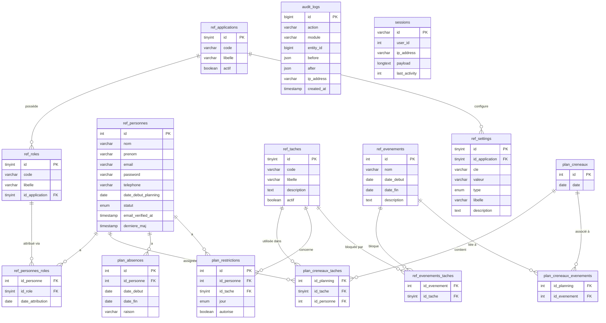

# Base de données — AMANA Planning

## Table des matières

1. [Schéma général](#schéma-général)
2. [Diagramme des relations](#diagramme-des-relations)
3. [Description des tables](#description-des-tables)

---

## Schéma général

La base de données est organisée en trois groupes fonctionnels :

| Groupe          | Préfixe          | Rôle                                                                                |
| --------------- | ---------------- | ----------------------------------------------------------------------------------- |
| **Référentiel** | `ref_`           | Données de configuration stables (personnes, rôles, tâches, paramètres, événements) |
| **Planning**    | `plan_`          | Données opérationnelles (créneaux, assignations, absences, restrictions)            |
| **Système**     | _(sans préfixe)_ | Tables techniques Laravel (sessions, jobs, cache, audit)                            |

---

## Diagramme des relations

---

## Description des tables

### `ref_applications`

Référentiel des applications du système AMANA partageant la même base de données. Chaque application possède ses propres rôles et paramètres.

| Colonne   | Type               | Description                                            |
| --------- | ------------------ | ------------------------------------------------------ |
| `id`      | TINYINT PK         | Identifiant auto-incrémenté                            |
| `code`    | VARCHAR(50) UNIQUE | Identifiant technique (`planning`, `livraisons`…)      |
| `libelle` | VARCHAR(100)       | Nom lisible                                            |
| `actif`   | BOOLEAN            | Permet de désactiver une application sans la supprimer |

> Actuellement une seule entrée : `planning` (id=1).

---

### `ref_roles`

Rôles disponibles par application. Un rôle est toujours rattaché à une application spécifique.

| Colonne          | Type         | Description                                                    |
| ---------------- | ------------ | -------------------------------------------------------------- |
| `id`             | TINYINT PK   | Identifiant                                                    |
| `code`           | VARCHAR(50)  | Code technique (`admin`, `gestionnaire`, `membre`, `benevole`) |
| `libelle`        | VARCHAR(100) | Libellé affiché                                                |
| `id_application` | TINYINT FK   | Application propriétaire du rôle                               |

> Contrainte unique : `(code, id_application)`.

---

### `ref_personnes`

Table centrale — remplace la table `users` standard de Laravel. Contient tous les membres, bénévoles et candidats.

| Colonne               | Type                 | Description                                                                                  |
| --------------------- | -------------------- | -------------------------------------------------------------------------------------------- |
| `id`                  | INT PK               | Identifiant                                                                                  |
| `nom`                 | VARCHAR(100)         | Nom de famille                                                                               |
| `prenom`              | VARCHAR(100)         | Prénom                                                                                       |
| `email`               | VARCHAR(255) UNIQUE  | Email = identifiant de connexion                                                             |
| `password`            | VARCHAR NULLABLE     | Hash bcrypt — NULL tant que le membre n'a pas créé son mot de passe via le lien d'invitation |
| `remember_token`      | VARCHAR              | Token "se souvenir de moi" (standard Laravel)                                                |
| `email_verified_at`   | TIMESTAMP NULLABLE   | Date de vérification email — renseigné à la création du mot de passe                         |
| `telephone`           | VARCHAR(20) NULLABLE | Numéro de téléphone                                                                          |
| `date_debut_planning` | DATE NULLABLE        | Date d'entrée dans la rotation — les créneaux antérieurs à cette date ne sont pas assignés   |
| `statut`              | ENUM                 | `En attente` / `Validé` / `Suspendu` / `Archivé`                                             |
| `derniere_maj`        | TIMESTAMP            | Mis à jour automatiquement à chaque modification                                             |

> **Seules les personnes avec `statut = Validé` sont incluses dans la génération du planning.**
> `date_debut_planning` est utilisée par l'algorithme pour ne pas assigner une nouvelle recrue avant son arrivée effective.

---

### `ref_personnes_roles`

Table pivot N-N entre personnes et rôles. Une personne ne peut avoir qu'un seul rôle par application.

| Colonne            | Type       | Description                    |
| ------------------ | ---------- | ------------------------------ |
| `id_personne`      | INT FK     | Référence vers `ref_personnes` |
| `id_role`          | TINYINT FK | Référence vers `ref_roles`     |
| `date_attribution` | DATE       | Date d'attribution du rôle     |

> Clé primaire composite : `(id_personne, id_role)`.

---

### `ref_taches`

Référentiel des tâches planifiables.

| Colonne       | Type               | Description                                                           |
| ------------- | ------------------ | --------------------------------------------------------------------- |
| `id`          | TINYINT PK         | Identifiant                                                           |
| `code`        | VARCHAR(50) UNIQUE | Code technique (`entree`, `mektaba`, `salle`, `amana_food`, `cours`…) |
| `libelle`     | VARCHAR(100)       | Libellé affiché                                                       |
| `description` | TEXT NULLABLE      | Description envoyée dans le payload webhook                           |
| `actif`       | BOOLEAN            | `true` = incluse dans la rotation du scheduler                        |

**Tâches actives (rotation) :** `entree`, `mektaba`, `salle`, `amana_food`, `cours`

**Tâches inactives (webhook uniquement) :** `rappel_sandwich`, `assistance_amana_food`, `annonce_cours`, `message_general`

---

### `ref_evenements`

Événements organisationnels (vacances, Ramadan, jours fériés…).

| Colonne       | Type          | Description                 |
| ------------- | ------------- | --------------------------- |
| `id`          | INT PK        | Identifiant                 |
| `nom`         | VARCHAR(150)  | Nom de l'événement          |
| `date_debut`  | DATE          | Début de la période         |
| `date_fin`    | DATE          | Fin de la période (incluse) |
| `description` | TEXT NULLABLE | Notes complémentaires       |

> Index sur `(date_debut, date_fin)` pour les recherches de chevauchement.

---

### `ref_evenements_taches`

Table pivot N-N entre événements et tâches bloquées. Si un événement n'a aucune entrée ici, il est purement informatif et n'affecte pas la génération.

| Colonne        | Type       | Description                     |
| -------------- | ---------- | ------------------------------- |
| `id_evenement` | INT FK     | Référence vers `ref_evenements` |
| `id_tache`     | TINYINT FK | Référence vers `ref_taches`     |

> Clé primaire composite : `(id_evenement, id_tache)`.

---

### `ref_settings`

Paramètres de configuration par application — paires clé/valeur typées.

| Colonne          | Type                | Description                                                                  |
| ---------------- | ------------------- | ---------------------------------------------------------------------------- |
| `id`             | TINYINT PK          | Identifiant                                                                  |
| `id_application` | TINYINT FK NULLABLE | Application concernée (NULL = global)                                        |
| `cle`            | VARCHAR(100)        | Clé du paramètre (`heure_cours`, `offset_entree_debut`…)                     |
| `valeur`         | VARCHAR(500)        | Valeur stockée sous forme de chaîne                                          |
| `type`           | ENUM                | `string` / `integer` / `time` / `boolean` — utilisé pour le cast automatique |
| `libelle`        | VARCHAR(200)        | Libellé affiché dans l'UI                                                    |
| `description`    | TEXT NULLABLE       | Explication détaillée                                                        |

> Contrainte unique : `(id_application, cle)`.
> Le modèle `Setting` inclut un cache statique par requête HTTP pour éviter les requêtes N+1.

---

### `plan_creneaux`

Un créneau = une date de permanence (vendredi ou samedi). Une seule ligne par date.

| Colonne | Type        | Description           |
| ------- | ----------- | --------------------- |
| `id`    | INT PK      | Identifiant           |
| `date`  | DATE UNIQUE | Date de la permanence |

> L'accesseur `jour` retourne `"Vendredi"` ou `"Samedi"`. L'accesseur `semaine` retourne le numéro de semaine ISO.

---

### `plan_creneaux_taches`

Cœur du planning : lie un créneau à une tâche et à la personne assignée.

| Colonne       | Type            | Description                                   |
| ------------- | --------------- | --------------------------------------------- |
| `id_planning` | INT FK          | Référence vers `plan_creneaux`                |
| `id_tache`    | TINYINT FK      | Référence vers `ref_taches`                   |
| `id_personne` | INT FK NULLABLE | Personne assignée — NULL = tâche non assignée |

> Clé primaire composite : `(id_planning, id_tache)`.
> La suppression d'un créneau déclenche la suppression en cascade de toutes ses assignations.

---

### `plan_creneaux_evenements`

Table pivot N-N entre créneaux et événements actifs à la date du créneau. Peuplée lors de la génération.

| Colonne        | Type   | Description                     |
| -------------- | ------ | ------------------------------- |
| `id_planning`  | INT FK | Référence vers `plan_creneaux`  |
| `id_evenement` | INT FK | Référence vers `ref_evenements` |

> Clé primaire composite : `(id_planning, id_evenement)`.

---

### `plan_absences`

Périodes d'absence des membres. Une personne absente n'est pas assignée lors de la génération pour les créneaux couverts.

| Colonne       | Type                  | Description                |
| ------------- | --------------------- | -------------------------- |
| `id`          | INT PK                | Identifiant                |
| `id_personne` | INT FK                | Personne concernée         |
| `date_debut`  | DATE                  | Début de l'absence         |
| `date_fin`    | DATE                  | Fin de l'absence (incluse) |
| `raison`      | VARCHAR(255) NULLABLE | Motif libre                |

> Index sur `id_personne` et `(date_debut, date_fin)`.

---

### `plan_restrictions`

Disponibilités par personne, tâche et jour de la semaine.

| Colonne       | Type       | Description                                               |
| ------------- | ---------- | --------------------------------------------------------- |
| `id`          | INT PK     | Identifiant                                               |
| `id_personne` | INT FK     | Personne concernée                                        |
| `id_tache`    | TINYINT FK | Tâche concernée                                           |
| `jour`        | ENUM       | `Lundi` à `Dimanche`                                      |
| `autorise`    | BOOLEAN    | `true` = peut faire la tâche ce jour / `false` = interdit |

> Contrainte unique : `(id_personne, id_tache, jour)`.
> **Comportement par défaut :** si aucune ligne n'existe pour une combinaison, la personne est considérée **disponible**. Une ligne n'est créée que pour exprimer une contrainte explicite.

---

### `audit_logs`

Journal d'audit de toutes les actions sensibles.

| Colonne       | Type             | Description                                                                           |
| ------------- | ---------------- | ------------------------------------------------------------------------------------- |
| `id`          | BIGINT PK        | Identifiant                                                                           |
| `action`      | VARCHAR(100)     | `create`, `update`, `delete`, `generate`, `login`, `logout`, `webhook`                |
| `module`      | VARCHAR(100)     | `personnes`, `planning`, `restrictions`, `absences`, `evenements`, `auth`, `settings` |
| `entity_id`   | BIGINT NULLABLE  | ID de l'entité modifiée                                                               |
| `entity_type` | VARCHAR NULLABLE | Classe du modèle (usage futur)                                                        |
| `before`      | JSON NULLABLE    | État avant modification                                                               |
| `after`       | JSON NULLABLE    | État après modification                                                               |
| `ip_address`  | VARCHAR(45)      | Adresse IP de l'auteur                                                                |
| `user_agent`  | TEXT             | Navigateur                                                                            |
| `created_at`  | TIMESTAMP        | Date de l'action                                                                      |

> Utilisé via le helper global `audit('action', 'module', $id, $avant, $apres)`.

---

### `sessions`

Sessions utilisateurs (driver `database` de Laravel).

| Colonne         | Type         | Description                            |
| --------------- | ------------ | -------------------------------------- |
| `id`            | VARCHAR PK   | Identifiant de session                 |
| `user_id`       | INT NULLABLE | Référence vers `ref_personnes`         |
| `ip_address`    | VARCHAR(45)  | Adresse IP                             |
| `user_agent`    | TEXT         | Navigateur                             |
| `payload`       | LONGTEXT     | Données de session sérialisées         |
| `last_activity` | INT          | Timestamp Unix de la dernière activité |

---

### `password_reset_tokens`

Tokens de réinitialisation de mot de passe (standard Laravel, broker `personnes`).

| Colonne      | Type       | Description                            |
| ------------ | ---------- | -------------------------------------- |
| `email`      | VARCHAR PK | Email de la personne                   |
| `token`      | VARCHAR    | Token hashé                            |
| `created_at` | TIMESTAMP  | Date de création — expire après 60 min |

---

### `jobs` / `job_batches` / `failed_jobs`

Tables standard Laravel pour la gestion des queues.

> Avec `QUEUE_CONNECTION=sync`, ces tables ne sont **pas utilisées** mais restent présentes dans le schéma (créées par la migration Laravel par défaut). Elles peuvent être ignorées.

---

### `cache` / `cache_locks`

Tables standard Laravel pour le driver de cache `database`.
