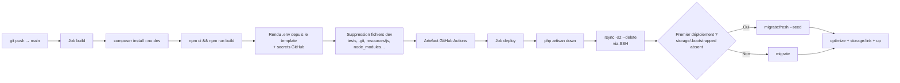

# Guide d'installation — AMANA Planning

## Table des matières

1. [Prérequis généraux](#prérequis-généraux)
2. [Installation en environnement local](#installation-en-environnement-local)
3. [Déploiement en production — pipeline GitHub Actions → IONOS](#déploiement-en-production--pipeline-github-actions--ionos)
4. [Première connexion et changement de mot de passe](#première-connexion-et-changement-de-mot-de-passe)
5. [Référence des routes principales](#référence-des-routes-principales)
6. [Résolution des problèmes courants](#résolution-des-problèmes-courants)

---

## Prérequis généraux

| Composant       | Version minimale | Notes                                                                           |
| --------------- | ---------------- | ------------------------------------------------------------------------------- |
| PHP             | 8.2+             | 8.4 recommandé (utilisé par la CI et par IONOS)                                 |
| MySQL / MariaDB | 8.0+ / 10.4+     |                                                                                 |
| Nginx           | 1.24+            | Développement local uniquement — IONOS gère son propre Apache                   |
| Composer        | 2.x              |                                                                                 |
| Node.js         | 20.19+ ou 22.x   | Requis en développement local **et** dans la CI (build Vite : Vue 3 + Tailwind) |
| npm             | Inclus avec Node |                                                                                 |
| Git             | 2.x              |                                                                                 |

> **Sur le serveur IONOS lui-même, Node.js et Composer ne sont pas requis.** Le build (`composer install`, `npm run build`) se fait entièrement dans le pipeline GitHub Actions ; seul le résultat déjà compilé (code PHP + `public/build/`) est envoyé sur le serveur par `rsync`. Voir [Déploiement en production](#déploiement-en-production--pipeline-github-actions--ionos).

---

## Installation en environnement local

### 1. Mettre à jour le système

```bash
sudo apt update && sudo apt upgrade -y
```

### 2. Installer PHP 8.4

Ubuntu 24.04 ne fournit pas PHP 8.4 dans ses dépôts officiels. On utilise le PPA d'Ondřej Surý.

```bash
sudo apt install -y software-properties-common
sudo add-apt-repository ppa:ondrej/php -y
sudo apt update

sudo apt install -y \
    php8.4 php8.4-fpm php8.4-cli php8.4-mysql \
    php8.4-mbstring php8.4-xml php8.4-curl php8.4-zip \
    php8.4-bcmath php8.4-tokenizer php8.4-ctype \
    php8.4-fileinfo php8.4-dom php8.4-intl php8.4-gd

# Définir PHP 8.4 comme version par défaut
sudo update-alternatives --set php /usr/bin/php8.4
php -v
```

### 3. Installer Nginx

```bash
sudo apt install -y nginx
sudo systemctl enable nginx && sudo systemctl start nginx
```

### 4. Installer MariaDB

```bash
sudo apt install -y mariadb-server mariadb-client
sudo systemctl enable mariadb && sudo systemctl start mariadb
sudo mariadb-secure-installation
```

### 5. Créer la base de données

```bash
sudo mariadb -u root -p
```

```sql
CREATE DATABASE amana CHARACTER SET utf8mb4 COLLATE utf8mb4_unicode_ci;
CREATE USER 'amana_user'@'localhost' IDENTIFIED BY 'motdepasse';
GRANT ALL PRIVILEGES ON amana.* TO 'amana_user'@'localhost';
FLUSH PRIVILEGES;
EXIT;
```

### 6. Installer Composer

```bash
curl -sS https://getcomposer.org/installer | php
sudo mv composer.phar /usr/local/bin/composer
sudo chmod +x /usr/local/bin/composer
composer -V
```

### 7. Installer Node.js 22

Node.js 18 (version par défaut sur Ubuntu 24.04) n'est **pas compatible** avec Vite 6. Il faut Node.js 20.19+ ou 22.x.

```bash
# Supprimer l'ancienne version si présente
sudo apt remove -y nodejs npm
sudo apt autoremove -y

# Installer Node.js 22 via NodeSource
curl -fsSL https://deb.nodesource.com/setup_22.x | sudo -E bash -
sudo apt install -y nodejs

# Vérifier
node -v   # v22.x.x
npm -v
```

### 8. Cloner le projet

```bash
sudo mkdir -p /var/www/amana-planning
sudo chown $USER:$USER /var/www/amana-planning
git clone https://github.com/votre-organisation/amana-planning.git /var/www/amana-planning
cd /var/www/amana-planning
```

### 9. Installer les dépendances PHP

```bash
composer install
```

### 10. Installer les dépendances Node et builder le frontend (Vue 3 + Tailwind)

Le frontend applicatif (planning, événements, bilan, formulaires interactifs…) est écrit en **Vue 3** (composants `.vue` sous `resources/js/`), compilé par **Vite**, avec **Tailwind CSS**. Ce n'est plus du CSS statique seul — le JavaScript de l'app doit être compilé avant de pouvoir utiliser l'application, y compris en local.

```bash
npm install
npm run build
```

> **`npm run build`** compile les composants Vue et le CSS Tailwind dans `public/build/` (fichiers hashés + `manifest.json`, lus par la directive Blade `@vite(...)`). Ce dossier est **ignoré par git** (`.gitignore`) — il doit être régénéré à chaque installation/déploiement, ce que fait la CI automatiquement en production (voir plus bas).
>
> En développement actif, utilisez `npm run dev` : serveur Vite avec hot-module-replacement, rechargement instantané des composants Vue et du CSS sans recompilation manuelle.
>
> **`npm run type-check`** (`vue-tsc --noEmit`) vérifie les types TypeScript de tous les composants `.vue` sans générer de fichiers — utile avant de committer une modification frontend.

### 11. Configurer l'environnement

```bash
cp .env.example .env
php artisan key:generate
```

Éditer `.env` :

```dotenv
APP_NAME="AMANA Planning"
APP_ENV=local
APP_DEBUG=true
APP_URL=http://localhost

DB_CONNECTION=mysql
DB_HOST=127.0.0.1
DB_PORT=3306
DB_DATABASE=amana
DB_USERNAME=amana_user
DB_PASSWORD=motdepasse

SESSION_DRIVER=file
SESSION_LIFETIME=120

QUEUE_CONNECTION=sync
CACHE_STORE=database

MAIL_MAILER=log

GOOGLE_SERVICE_ACCOUNT_JSON_BASE64=
```

> **`MAIL_MAILER=log`** : les emails s'écrivent dans `storage/logs/laravel.log` au lieu d'être envoyés — pratique en développement.
>
> **`HEURE_COURS` est obsolète** et ignorée. L'heure du cours est gérée via **Paramètres → Heure du cours** dans l'interface.
>
> **`GOOGLE_SERVICE_ACCOUNT_JSON_BASE64` vide** : aucune synchronisation Google Calendar n'est effectuée (la queue le journalise et ignore silencieusement l'appel) — pratique pour développer sans toucher à un vrai calendrier. Pour l'activer en local, voir [docs/google_service_account.md](google_service_account.md) pour la procédure complète (création du compte de service Google Cloud, partage des calendriers, encodage en base64).

### 12. Permissions des dossiers

```bash
sudo chown -R $USER:www-data /var/www/amana-planning
sudo chmod -R 755 /var/www/amana-planning
sudo chmod -R 775 /var/www/amana-planning/storage
sudo chmod -R 775 /var/www/amana-planning/bootstrap/cache
```

### 13. Migrations et seeders

```bash
php artisan migrate --force
php artisan db:seed --force
```

Crée toutes les tables et le compte administrateur par défaut :

| Champ        | Valeur           |
| ------------ | ---------------- |
| Email        | `admin@amana.fr` |
| Mot de passe | `changeme123!`   |

> ⚠️ **Changer ce mot de passe immédiatement après la première connexion.**

### 14. Lien de stockage public

```bash
php artisan storage:link
```

### 15. Configurer Nginx

```bash
sudo nano /etc/nginx/sites-available/amana-planning
```

```nginx
server {
    listen 80;
    server_name localhost;

    root /var/www/amana-planning/public;
    index index.php index.html;

    access_log /var/log/nginx/amana-planning.access.log;
    error_log  /var/log/nginx/amana-planning.error.log;

    location / {
        try_files $uri $uri/ /index.php?$query_string;
    }

    location ~ \.php$ {
        include snippets/fastcgi-php.conf;
        fastcgi_pass unix:/run/php/php8.4-fpm.sock;
        fastcgi_param SCRIPT_FILENAME $realpath_root$fastcgi_script_name;
        include fastcgi_params;
    }

    location ~ /\. {
        deny all;
    }

    location ~* \.(css|js|png|jpg|jpeg|gif|ico|svg|woff|woff2)$ {
        expires 30d;
        add_header Cache-Control "public, immutable";
    }
}
```

```bash
sudo ln -s /etc/nginx/sites-available/amana-planning /etc/nginx/sites-enabled/
sudo rm -f /etc/nginx/sites-enabled/default
sudo nginx -t
sudo systemctl reload nginx
```

### 16. Vérifier l'installation

Ouvrir <http://localhost>. La page de connexion AMANA Planning doit s'afficher.

```bash
# En cas de problème
sudo tail -f /var/log/nginx/amana-planning.error.log
tail -f /var/www/amana-planning/storage/logs/laravel.log
```

---

## Déploiement en production — pipeline GitHub Actions → IONOS

Le déploiement **n'est plus manuel** (pas de `git pull` + script sur le serveur). Chaque push sur la branche **`main`** déclenche automatiquement `.github/workflows/deploy.yaml`, qui build l'application puis la livre sur IONOS par SSH/rsync.



### Ce que fait le job `build`

1. Checkout du code (avec sous-modules).
2. PHP 8.4 + `composer install --optimize-autoloader --no-dev --no-interaction`.
3. Node.js 22.x (cache npm) + `npm ci` + `npm run build` — compile les composants Vue et le CSS Tailwind dans `public/build/`.
4. Rendu du `.env` de production à partir de `.github/deploy/.env.production.template`, en substituant chaque `${VARIABLE}` par le secret/variable GitHub correspondant. Le job **échoue explicitement** si un placeholder `${...}` reste non résolu après substitution (secret manquant) — voir [Résolution des problèmes courants](#résolution-des-problèmes-courants).
5. Suppression des fichiers non nécessaires en production (`tests`, `.github`, `.git`, `docs`, `resources/js`, `resources/css`, `node_modules`, fichiers de config du tooling…) — seul le code applicatif + `public/build/` compilé partent sur IONOS.
6. Upload du résultat comme artefact GitHub Actions (rétention 1 jour), transmis au job `deploy`.

### Ce que fait le job `deploy`

1. Récupère l'artefact du job `build`.
2. Ouvre une connexion SSH (clé privée en secret, host ajouté à `known_hosts`).
3. Passe l'application en **mode maintenance** (`php artisan down`) — best effort, ne bloque pas si ça échoue (ex. premier déploiement, rien à mettre en maintenance).
4. Synchronise les fichiers vers IONOS via `rsync -az --delete` (le dossier `storage/` est **exclu** — jamais écrasé entre deux déploiements, les uploads/logs sont préservés).
5. Recrée l'arborescence `storage/` si absente (premier déploiement).
6. Exécute les commandes post-déploiement sur le serveur via SSH :
    - Corrige les permissions (`chmod 664` fichiers / `775` dossiers, `o+w` sur `storage` et `bootstrap/cache`).
    - **Détecte le premier déploiement** via le marqueur `storage/.bootstrapped` : s'il est absent (ou si `force_fresh_install` a été forcé manuellement), exécute `migrate:fresh --seed` puis crée le marqueur. Sinon, exécute un `migrate` classique (non destructif).
    - `optimize:clear`, `storage:link`, `optimize`, puis repasse l'app en ligne (`artisan up`).

> ⚠️ **`migrate:fresh --seed` efface toute la base de données.** Il ne s'exécute automatiquement qu'une seule fois (premier déploiement, marqueur absent). Pour le redéclencher volontairement (ex. réinitialiser complètement un environnement de test), utilisez **Actions → Build and Deploy to IONOS → Run workflow**, en cochant `force_fresh_install`. Ne jamais faire ça sur la production réelle sans sauvegarde préalable.

### Configuration requise — Secrets & Variables GitHub

À définir dans **Settings → Secrets and variables → Actions** du dépôt.

**Secrets** (`Repository secrets`) :

| Secret                  | Description                                                                  |
| ----------------------- | ---------------------------------------------------------------------------- |
| `APP_KEY`               | Clé Laravel (`php artisan key:generate --show` pour en générer une)          |
| `DB_HOST`               | Hôte de la base de données MySQL/MariaDB IONOS                               |
| `DB_NAME`               | Nom de la base                                                               |
| `DB_USERNAME`           | Utilisateur DB                                                               |
| `DB_PASSWORD`           | Mot de passe DB                                                              |
| `MAIL_HOST`             | Hôte SMTP (ex. `smtp.ionos.fr`)                                              |
| `MAIL_PORT`             | Port SMTP (587 avec STARTTLS)                                                |
| `MAIL_USERNAME`         | Compte SMTP (aussi utilisé comme adresse d'expédition)                       |
| `MAIL_PASSWORD`         | Mot de passe SMTP                                                            |
| `GOOGLE_SERVICE_ACCOUNT_JSON_BASE64` | Clé JSON du compte de service Google Cloud (Calendar API), encodée en base64 |
| `APP_EMERGENCY_KEY`     | Clé de l'outil d'urgence `/urgence-hash` — laisser vide sauf besoin ponctuel |
| `IONOS_SSH_PRIVATE_KEY` | Clé SSH privée pour se connecter au serveur IONOS                            |
| `IONOS_SSH_USER`        | Utilisateur SSH IONOS                                                        |
| `IONOS_SSH_HOST`        | Hôte SSH IONOS                                                               |

**Variables** (`Repository variables`) :

| Variable             | Description                                                                                         |
| -------------------- | --------------------------------------------------------------------------------------------------- |
| `APP_URL`            | URL publique de l'application (ex. `https://votredomaine.fr`)                                       |
| `IONOS_REMOTE_PATH`  | Chemin absolu du webspace sur le serveur IONOS (ex. `/homepages/.../htdocs`)                        |
| `IONOS_PHP_CLI_PATH` | Chemin du binaire PHP CLI sur IONOS (souvent différent du `php` du PATH, ex. `/usr/bin/php8.4-cli`) |

> Les secrets/variables `DB_*`, `MAIL_*`, `GOOGLE_SERVICE_ACCOUNT_JSON_BASE64` et `APP_EMERGENCY_KEY` sont substitués tels quels dans `.github/deploy/.env.production.template` — pour ajouter un nouveau paramètre `.env` de production, l'ajouter au template **et** créer le secret/variable GitHub correspondant, sous peine d'échec du job `build` (placeholder non résolu).

### Concurrence et sécurité du pipeline

- `concurrency: deploy-${{ github.ref }}` avec `cancel-in-progress: false` — deux déploiements simultanés sur la même branche ne s'exécutent jamais en parallèle ; le second attend la fin du premier plutôt que de l'annuler (évite un `rsync` interrompu à mi-chemin).
- Le pipeline se déclenche **uniquement** sur push vers `main` — pousser sur une autre branche ne déploie rien automatiquement.
- `workflow_dispatch` permet aussi un déclenchement manuel depuis l'onglet **Actions** du dépôt, avec l'option `force_fresh_install`.

### Suivre / déboguer un déploiement

Onglet **Actions** du dépôt GitHub → sélectionner l'exécution → chaque étape (`build`, `deploy`) affiche ses logs complets, y compris la sortie SSH distante des commandes post-déploiement (migrations, permissions…).

---

## Première connexion et changement de mot de passe

### Connexion initiale

1. Ouvrir l'application dans le navigateur
2. Se connecter avec `admin@amana.fr` / `changeme123!`

### Changer le mot de passe

#### Via l'interface (recommandé)

1. Se déconnecter
2. Aller sur `/mot-de-passe-oublie`
3. Saisir `admin@amana.fr`
4. Suivre le lien reçu par email (ou dans `storage/logs/laravel.log` si `MAIL_MAILER=log`)

#### Via l'outil d'urgence `/urgence-hash` (si SMTP non opérationnel)

1. Définir le secret GitHub `APP_EMERGENCY_KEY` (voir tableau des secrets ci-dessus) et redéployer, ou l'éditer directement dans le `.env` du serveur en urgence
2. Visiter `https://votredomaine.com/urgence-hash?key=une-cle-secrete`
3. Générer le hash bcrypt
4. Exécuter la requête SQL affichée dans phpMyAdmin
5. **Retirer `APP_EMERGENCY_KEY`** (secret GitHub vide + redéploiement, ou `.env` serveur) après usage

---

## Référence des routes principales

| Méthode | URL                                             | Nom                            | Accès              | Description                                                                             |
| ------- | ----------------------------------------------- | ------------------------------ | ------------------ | --------------------------------------------------------------------------------------- |
| GET     | `/`                                             | —                              | Public             | Redirige vers `/planning`                                                               |
| GET     | `/login`                                        | `login`                        | Public             | Formulaire de connexion                                                                 |
| GET     | `/inscription`                                  | `inscription`                  | Public             | Formulaire d'inscription publique                                                       |
| GET     | `/planning`                                     | `planning.index`               | Connecté           | Vue principale du planning                                                              |
| GET     | `/planning/data`                                | `planning.data`                | Connecté           | JSON consommé par le composant Vue `PlanningGrid`                                       |
| GET     | `/mon-planning`                                 | `mon-planning`                 | Connecté           | Vue personnelle                                                                         |
| GET     | `/planning/stats`                               | `planning.statistics`          | Connecté           | Statistiques                                                                            |
| GET     | `/planning/export`                              | `planning.export.form`         | Connecté           | Formulaire export PDF                                                                   |
| POST    | `/planning/export/pdf`                          | `planning.export.pdf`          | Connecté           | Génération PDF                                                                          |
| GET     | `/planning/generer`                             | `planning.generate.form`       | Gestionnaire+Admin | Formulaire de génération                                                                |
| POST    | `/planning/generer`                             | `planning.generate`            | Gestionnaire+Admin | Génération effective                                                                    |
| POST    | `/planning/generer/apercu`                      | `planning.preview`             | Gestionnaire+Admin | Prévisualisation dry-run                                                                |
| POST    | `/planning/overlap/cancel`                      | `planning.overlap.cancel`      | Gestionnaire+Admin | Annule la confirmation de chevauchement                                                 |
| POST    | `/planning/rollback`                            | `planning.rollback`            | Gestionnaire+Admin | Rollback post-génération                                                                |
| POST    | `/planning/rollback/dismiss`                    | `planning.rollback.dismiss`    | Gestionnaire+Admin | Ferme la session de rollback                                                            |
| POST    | `/planning/creneau`                             | `planning.edit.create-creneau` | Gestionnaire+Admin | Crée un créneau manuellement                                                            |
| DELETE  | `/planning/creneau/{id}`                        | `planning.edit.delete-creneau` | Gestionnaire+Admin | Supprime un créneau entier                                                              |
| PATCH   | `/planning/creneau/{creneauId}/tache/{tacheId}` | `planning.edit.assignation`    | Gestionnaire+Admin | Réassigne une tâche                                                                     |
| DELETE  | `/planning/creneau/{creneauId}/tache/{tacheId}` | `planning.edit.unassign`       | Gestionnaire+Admin | Désassigne une tâche                                                                    |
| POST    | `/planning/annulation-cours`                    | `planning.annulation-cours`    | Gestionnaire+Admin | **Annule le cours d'une date** — désassigne tout, bloque la date, nettoie le calendrier |
| GET     | `/absences`                                     | `absences.index`               | Connecté           | Liste des absences                                                                      |
| GET     | `/restrictions`                                 | `restrictions.index`           | Connecté           | Grille des disponibilités                                                               |
| GET     | `/evenements`                                   | `evenements.index`             | Connecté           | Liste des événements                                                                    |
| GET     | `/evenements/creer`                             | `evenements.create`            | Gestionnaire+Admin | Formulaire de création d'événement (calendriers multiples)                              |
| GET     | `/bilan`                                        | `bilan.index`                  | Connecté           | Bilan quotidien (Amana Food + Présences)                                                |
| GET     | `/bilan/statistiques`                           | `bilan.statistiques`           | Connecté           | Statistiques du bilan quotidien                                                         |
| GET     | `/parametres`                                   | `settings.index`               | Gestionnaire+Admin | Paramètres de l'application (inclut le registre des calendriers Google Calendar)        |
| POST    | `/parametres/calendriers-google`                | `calendriers-google.store`     | Gestionnaire+Admin | Ajoute un calendrier au registre (vérifié via `calendars.get()`)                         |
| PATCH   | `/parametres/calendriers-google/{id}`           | `calendriers-google.update`    | Gestionnaire+Admin | Modifie nom/description/statut actif d'un calendrier enregistré                          |
| DELETE  | `/parametres/calendriers-google/{id}`           | `calendriers-google.destroy`   | Gestionnaire+Admin | Retire un calendrier du registre                                                         |
| POST    | `/parametres/calendriers-google/{id}/verifier`  | `calendriers-google.verifier`  | Gestionnaire+Admin | Revérifie l'accès à un calendrier déjà enregistré                                         |
| GET     | `/personnes`                                    | `personnes.index`              | Admin              | Liste des membres                                                                       |
| GET     | `/admin/candidatures`                           | `admin.candidatures.index`     | Admin              | Tableau de bord des candidatures                                                        |
| GET     | `/admin/echanges`                               | `admin.echanges.index`         | Gestionnaire+Admin | Gestion des échanges                                                                    |
| GET     | `/diagnostic-mail`                              | `diagnostic.mail.index`        | Admin              | Diagnostic SMTP                                                                         |
| GET     | `/echanges`                                     | `echanges.index`               | Connecté           | Mes échanges                                                                            |
| GET     | `/api/calendriers`                              | `calendriers.index`            | Connecté           | JSON — calendriers Google Calendar **enregistrés** dans `ref_calendriers_google` (lecture DB, dropdown de recherche) |

---

## Résolution des problèmes courants

### Erreur 500 au premier déploiement

```bash
tail -f storage/logs/laravel.log
sudo chmod -R 775 storage bootstrap/cache
php artisan cache:clear && php artisan config:clear
```

### Nginx retourne 502 Bad Gateway (local)

```bash
sudo systemctl status php8.4-fpm
sudo systemctl restart php8.4-fpm
ls -la /run/php/php8.4-fpm.sock
```

### Erreur « Table sessions doesn't exist »

```bash
php artisan migrate --force
```

### Les emails ne partent pas

```bash
tail -f storage/logs/laravel.log
# Vérifier que MAIL_SCHEME n'est pas "null" (chaîne littérale)
# Tester via /diagnostic-mail dans l'interface
```

### Le job `build` échoue avec « secrets are missing »

```text
::error::One or more secrets are missing - .env still contains unresolved placeholders
```

Un ou plusieurs secrets/variables GitHub référencés dans `.github/deploy/.env.production.template` ne sont pas définis. Vérifier **Settings → Secrets and variables → Actions** contre le tableau de la section [Configuration requise](#configuration-requise--secrets--variables-github) — le nom du secret manquant apparaît dans le log de l'étape juste avant l'erreur.

### La page s'affiche sans style (CSS/JS manquant) en local

Le dossier `public/build/` est absent ou vide — il n'est **pas** committé dans git (contrairement à une ancienne version de ce projet).

```bash
npm install
npm run build
```

### Erreur npm « vite requires Node.js version 20.19+ »

```bash
sudo apt remove -y nodejs npm && sudo apt autoremove -y
curl -fsSL https://deb.nodesource.com/setup_22.x | sudo -E bash -
sudo apt install -y nodejs
node -v   # v22.x.x
rm -rf node_modules package-lock.json
npm install && npm run build
```

### Erreur npm « ERESOLVE — laravel-vite-plugin peer vite »

`package.json` contient `"vite": "^8.x"` — incompatible avec `laravel-vite-plugin`. Corriger :

```json
"vite": "^6.0.0"
```

```bash
rm -rf node_modules package-lock.json
npm install && npm run build
```

### Warning PostCSS « @import must precede all other statements »

Dans `resources/css/app.css`, les `@import` doivent précéder les directives `@tailwind`. Vérifier l'ordre :

```css
@import url("https://fonts.googleapis.com/...");
@import "../../public/css/custom.css";

@tailwind base;
@tailwind components;
@tailwind utilities;
```

### Erreur TypeScript lors de `npm run type-check` ou `npm run build`

```bash
npx vue-tsc --noEmit
```

Affiche le fichier et la ligne exacts. Les types partagés du module Planning (formes des réponses JSON, `window.PlanningConfig`) sont centralisés dans `resources/js/types/planning.ts` — si une route ou un champ JSON change côté PHP, mettre à jour ce fichier en premier.

### Page blanche après config:cache

```bash
php artisan config:clear && php artisan config:cache
```

### Nginx retourne 403 Forbidden (local)

```bash
grep -r "root" /etc/nginx/sites-enabled/amana-planning
# Vérifier que root pointe vers /var/www/amana-planning/public
```

### La prévisualisation (Aperçu) est lente

Normal — le dry-run exécute l'algorithme complet. Pour des plannings > 20 semaines :

```bash
sudo nano /etc/php/8.4/fpm/php.ini
# max_execution_time = 120
sudo systemctl restart php8.4-fpm
```

### Problème de session (déconnexion intempestive) en production

```dotenv
SESSION_DRIVER=database
SESSION_SECURE_COOKIE=true
SESSION_DOMAIN=votredomaine.fr
```

```bash
php artisan migrate --force   # Crée la table sessions si absente
```

### Un événement bloquant créé après génération ne bloque pas un créneau passé

Comportement voulu, pas un bug : les créneaux dont la date est déjà passée ne sont **jamais** modifiés rétroactivement par la création/modification d'un événement (désassignation, liaison informative) — cela fausserait les statistiques et l'équité de répartition déjà constatées. Un message d'avertissement explicite s'affiche à la place. Voir README, section Événements, et `docs/Schema_bdd.md` (table `ref_evenements`).
